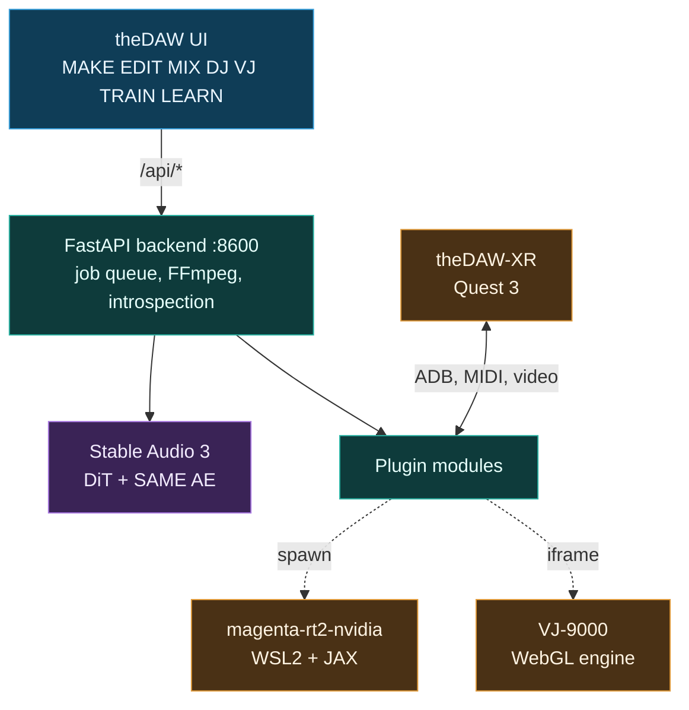
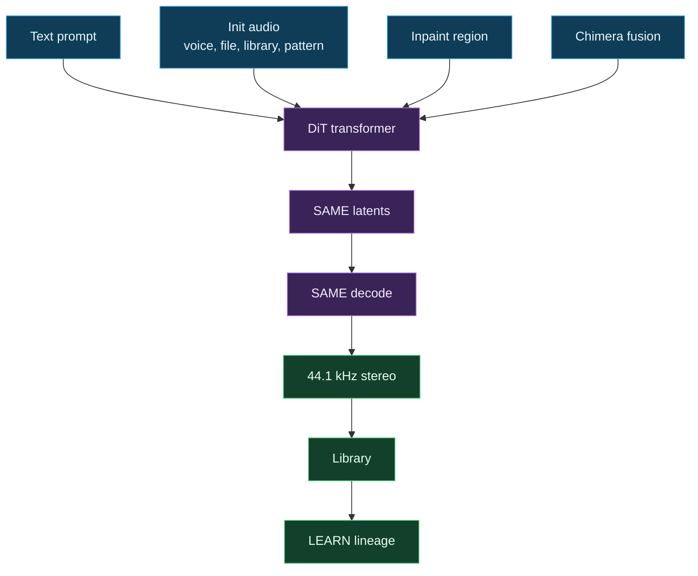
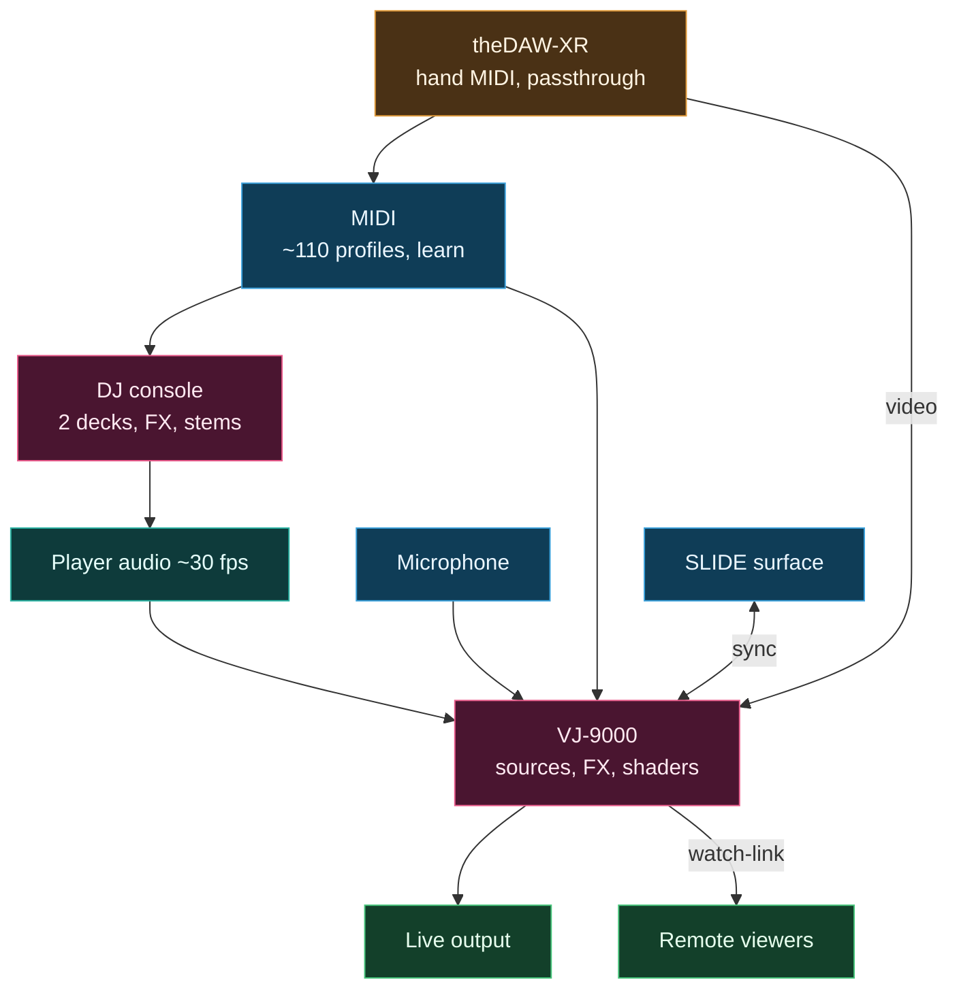

<h1 align="center">theDAW</h1>

<p align="center"><strong>by <a href="https://gantasmo.com">GANTASMO</a></strong></p>

<p align="center">
  <a href="https://www.python.org/"></a>
  <a href="https://pytorch.org/"></a>
  <a href="https://react.dev/"></a>
  <a href="https://fastapi.tiangolo.com/"></a>
  <br>
  
  
  <a href="https://github.com/gantasmo/theDAW-XR"></a>
  
</p>

<p align="center">
  <a href="https://open.spotify.com/artist/4q5n0QgK6mvyuw8FRzhuNA"></a>
  <a href="https://www.youtube.com/@GANTASMO"></a>
  <a href="https://www.instagram.com/gantasmo"></a>
  <a href="https://x.com/gantasmo"></a>
  <a href="https://gantasmo.com"></a>
</p>

> **GANTASMO** is an amorphous entity by [Daniel Joaquin Trujillo](https://github.com/danieljtrujillo) and [Josh Valenzuela](https://github.com/StarskreamEXE) that defies conventional classification. We make thought provoking, highly technical, yet listenable music inspired by the underappreciated pioneers of modern music. Beyond musical composition and performance, GANTASMO is a powerhouse of research and development in the fields Artificial Intelligence, Augmented Reality, Virtual Reality, the democratization of musical tools and education, and the preservation and evolution of musical history and traditions predating modern recording infrastructure.

---

theDAW is an all-in-one application for music creation. The generative engine renders audio from several inputs: supplied init audio, a text prompt, a painted inpaint region, and the Chimera engine that analyzes, blends, and beat-aligns several source clips into one generation. The workspace opens into a full studio for composition, arrangement, editing, and mixing, and into a live rig for DJing and VJing with deep MIDI mapping for any controller. theDAW covers the full path from an initial idea through a finished render to a live performance, and pairs with [theDAW-XR](https://github.com/gantasmo/theDAW-XR) on Meta Quest 3 for hands-only spatial control.

theDAW also ships the first non-Mac port of Google's Magenta RealTime 2, vendored as the [magenta-rt2-nvidia](https://github.com/gantasmo/magenta-rt2-nvidia) sidecar, which runs on Windows with WSL2 and NVIDIA, on native Linux, and on cloud GPUs. Models stay under the user's control: nothing downloads at startup, **local-only mode is on by default**, and a model loads at the first CREATE that needs it.

<p align="center">
  <a href="showcase/clips-recorded/_showcase_h.mp4">
    
  </a>
  <br>
  <sub><em>Click to watch the full feature tour, also available <a href="showcase/clips-recorded/_showcase_v.mp4">vertical (9:16)</a>.</em></sub>
</p>

<p align="center">
  
</p>

---

## Quickstart

**Double-click `theDAW.bat`. That is the entire setup.** It checks the machine, installs anything missing after one quick confirmation, and opens theDAW in the browser. The Stable Audio model downloads on its own the first time a track is generated.

```powershell
.\theDAW.bat
```

The launcher checks prerequisites, bootstraps dependencies when the tree is fresh (`uv sync --group dev`, `npm install`), clears stale processes on ports 5173/8600/5187, then runs the backend, Vite, and an optional tunnel together in one console and opens `http://localhost:5173`. Manual launch:

```bash
uv run uvicorn backend.server:app --host 0.0.0.0 --port 8600 --reload   # backend
cd frontend && npm run dev                                              # frontend
```

> The full [User Guide](docs/USER_GUIDE.md) is a deep power-user reference. It runs long and parts can lag the current app, so it works best as a reference rather than a first stop. Quick links: [Windows Setup](docs/windows/setup-guide.md), [Prompting](docs/guides/prompting.md), [§3 Installation](docs/USER_GUIDE.md#3-installation).

### Prerequisites

`theDAW.bat` installs these automatically the first time a tool is missing. The list is here for reference and for manual or non-Windows setups.

| Tool | Role |
|---|---|
| **[uv](https://docs.astral.sh/uv/getting-started/installation/)** | Python environment and package manager. Creates the venv and installs torch and CUDA. |
| **[Node.js](https://nodejs.org/) 20.19+ or 22.12+** | Frontend dev server and the VJ sidecar. Vite 7 sets the floor. |
| **[FFmpeg](https://www.gyan.dev/ffmpeg/builds/)** on PATH | Every audio path: effects, exports, library ingest, MIDI conversion, import. |
| **[Git](https://git-scm.com/)** | Clones the repo. `--recurse-submodules` brings in the Magenta sidecar source. |
| **NVIDIA driver 550+** | Runs the Medium model and Magenta. The Small model runs on CPU. |

---

## Architecture

theDAW is a React frontend over a FastAPI backend that wraps the Stable Audio 3 pipeline, a plugin module system, and spawned sidecars. The frontend proxies `/api/*` to the backend on port 8600. The wiki [Dataflow](https://github.com/gantasmo/theDAW/wiki/Dataflow) page maps every input and output in one chart.

**System.**



**Generation.** Several inputs condition one generation; the DiT renders latents, the autoencoder decodes them, every render saves to the library, and LEARN draws the lineage.



**Routing.** Player audio, a microphone, MIDI, and SLIDE drive the VJ engine and the DJ console, and theDAW-XR feeds hand-tracked MIDI and passthrough video into the same buses.



---

## Features

Every feature has a full reference in the [User Guide](docs/USER_GUIDE.md). Names link to the section below or the relevant guide.

### Studio

- **[MAKE](#make)** generates audio from one form. [Text-to-audio](docs/USER_GUIDE.md#6-make-tab), [audio-to-audio](docs/USER_GUIDE.md#6-make-tab), [inpainting](docs/USER_GUIDE.md#6-make-tab), and [continuation](docs/USER_GUIDE.md#6-make-tab) all condition the same generation, alongside the [microphone recorder](docs/USER_GUIDE.md#6-make-tab), [Chimera fusion](docs/USER_GUIDE.md#6-make-tab), the [Spectrogram viewer](docs/USER_GUIDE.md#6-make-tab), [templates and saved prompts](docs/USER_GUIDE.md#6-make-tab), and the [async job queue](docs/USER_GUIDE.md#19-backend-api-reference).
- **[Generate](#generate)** adds cloud and real-time engines: [Suno](docs/USER_GUIDE.md#26-cloud-generation-suno) in simple, custom, cover, and mashup modes, and [Magenta RealTime 2](docs/USER_GUIDE.md#27-magenta-realtime-2) text-to-music with MIDI-note and audio-style conditioning.
- **[EDIT](#edit)** is the multi-track timeline: [per-clip waveforms](docs/USER_GUIDE.md#7-edit-tab), [move and cut](docs/USER_GUIDE.md#7-edit-tab), a [snap grid](docs/USER_GUIDE.md#7-edit-tab), a [live per-track mixer](docs/USER_GUIDE.md#7-edit-tab), [trim and fade handles](docs/USER_GUIDE.md#7-edit-tab), [inpaint from editor](docs/USER_GUIDE.md#7-edit-tab), and [commit to one stereo WAV](docs/USER_GUIDE.md#7-edit-tab).
- **[MIX](#mix)** is the effects and mastering stage: a [24-effect FFmpeg chain](docs/USER_GUIDE.md#8-mix-tab), [Quick Master macros](docs/USER_GUIDE.md#8-mix-tab), [process history](docs/USER_GUIDE.md#8-mix-tab), and the six-family [Edit Tool Stack](docs/USER_GUIDE.md#28-edit-tool-stack).
- **[TRAIN](#train)** fits [LoRA adapters](docs/USER_GUIDE.md#22-lora-adapter-types): eight [adapter types](docs/USER_GUIDE.md#22-lora-adapter-types), [layer filtering](docs/workflows/lora.md), [interval gating](docs/workflows/lora.md), [SVD bases](docs/workflows/lora.md), and [autoencoder round-trips](docs/workflows/autoencoder.md).
- **[LEARN](#learn)** renders the [genealogy graph](docs/USER_GUIDE.md#12-learn-tab) in [3D and 2D](docs/USER_GUIDE.md#12-learn-tab) with a [layered SVG DAG](docs/USER_GUIDE.md#12-learn-tab) and [lineage edges](docs/USER_GUIDE.md#12-learn-tab) for every remix, inpaint, stem split, Chimera blend, and Suno cover.

### Live rig

- **[DJ](#dj)** runs two decks with [beatmatch sync and key-lock](docs/USER_GUIDE.md#9-dj-tab), [EQ, filter, and trim](docs/USER_GUIDE.md#9-dj-tab), [hotcues, loops, slip, and quantize](docs/USER_GUIDE.md#9-dj-tab), a [per-deck FX rack and master limiter](docs/USER_GUIDE.md#9-dj-tab), [live stems](docs/USER_GUIDE.md#9-dj-tab), [cue output](docs/USER_GUIDE.md#9-dj-tab), [Automix and a sampler bank](docs/USER_GUIDE.md#9-dj-tab), [MIDI-learn](docs/USER_GUIDE.md#9-dj-tab), [URL import](docs/USER_GUIDE.md#30-youtube-import), and [Design Mode](docs/USER_GUIDE.md#9-dj-tab).
- **[VJ](#vj)** drives the [VJ-9000](https://github.com/gantasmo/VJ-9000) visual engine: a [3D reactive terrain](docs/USER_GUIDE.md#10-vj-tab), [camera sources](docs/USER_GUIDE.md#10-vj-tab) including phones and Quest headsets, a [GLSL shader source](https://github.com/gantasmo/VJ-9000) with fractals, materials, and audio-mapped params, an [ASCII effect](https://github.com/gantasmo/VJ-9000), [cymatics](docs/USER_GUIDE.md#10-vj-tab) and depth-cloud sources, [source banks](https://github.com/gantasmo/VJ-9000), a [GPU effect chain](docs/USER_GUIDE.md#10-vj-tab), [Autopilot and BPM sync](docs/USER_GUIDE.md#10-vj-tab), [recording and transcode](docs/USER_GUIDE.md#10-vj-tab), and a [watch-link broadcast](docs/guides/dj-and-genealogy.md).
- **[Controllers and XR](#controllers-and-xr)** bind hardware and headsets: a [~110-profile library with auto-detect](docs/USER_GUIDE.md#31-controller-vision), [learn-by-capture](docs/USER_GUIDE.md#31-controller-vision), [Controller Vision](docs/USER_GUIDE.md#31-controller-vision), and the [theDAW-XR](docs/USER_GUIDE.md#34-quest-and-xr-integrations) circuit of hand-tracked MIDI, passthrough streaming, co-located multiplayer, and the MIDI Reactor.

### Library, notation, and tools

- **[Library and Catalogue](#library-and-catalogue)**: a [disk-backed library](docs/USER_GUIDE.md#13-library) with [search, sort, and favorites](docs/USER_GUIDE.md#13-library), [inline playback](docs/USER_GUIDE.md#13-library), [play counts](docs/USER_GUIDE.md#13-library), the [SUGGEST playlist](docs/USER_GUIDE.md#13-library), and the cross-provider [Catalogue gallery](docs/USER_GUIDE.md#29-catalogue) with a lineage panel.
- **[Notation and Score](#notation-and-score)**: [MAKE SHEET to MusicXML](docs/USER_GUIDE.md#33-notation-score-tabs-and-arrangements), [guitar and bass tabs](docs/USER_GUIDE.md#33-notation-score-tabs-and-arrangements), [arrangements](docs/USER_GUIDE.md#33-notation-score-tabs-and-arrangements), [ABC, PDF, and SVG export](docs/USER_GUIDE.md#33-notation-score-tabs-and-arrangements), and [prompt inference](docs/USER_GUIDE.md#33-notation-score-tabs-and-arrangements).
- **[Bottom panel](#bottom-panel)**: the [spectral analyzer](docs/USER_GUIDE.md#16-bottom-panel-tabs), [piano roll](docs/USER_GUIDE.md#15-piano-roll), [step sequencer](docs/USER_GUIDE.md#14-step-sequencer), [media bucket](docs/USER_GUIDE.md#16-bottom-panel-tabs), the [SLIDE control surface](docs/USER_GUIDE.md#16-bottom-panel-tabs), and Details.
- **[Footer, log, and assistant](#footer-log-and-assistant)**: the [player footer](docs/USER_GUIDE.md#17-player-footer), the [processing log](docs/USER_GUIDE.md#18-processing-log), and the [multi-provider assistant](docs/USER_GUIDE.md#32-admin-module-and-assistant-key-apis) with RAG over these docs.
- **[Settings and Models](#models)**: [model readiness](docs/USER_GUIDE.md#21-models), [native checkpoint registration](docs/USER_GUIDE.md#21-models), a [storage map](docs/USER_GUIDE.md#21-models), and [module enable and disable](docs/USER_GUIDE.md#32-admin-module-and-assistant-key-apis).

---

## Workspaces

### MAKE

<p align="center"></p>

One form drives text-to-audio, audio-to-audio, inpainting, and continuation. Supplied init audio, a text prompt, a painted inpaint region, and a Chimera stack all condition the same generation, and the init noise level sets how far the result departs from the source. Chimera blends several clips into one generation and beat-aligns them under Start, Downbeat, or Phrase Weave alignment. Templates store full parameter sets, Saved Prompts keep a history, and the async job queue saves every render to the library. Full reference: [User Guide §6](docs/USER_GUIDE.md#6-make-tab).

### Generate

<p align="center"></p>

Suno cloud generation runs in the Aurora Cloud Console across simple, custom, cover, and mashup modes, and cover and mashup results write lineage edges. Magenta RealTime 2 provides text-to-music whenever its sidecar is running, through the first non-Mac MRT2 port vendored at [magenta-rt2-nvidia](https://github.com/gantasmo/magenta-rt2-nvidia). The extended sidecar also accepts MIDI-note and audio-style conditioning. Full reference: [User Guide §26](docs/USER_GUIDE.md#26-cloud-generation-suno) and [§27](docs/USER_GUIDE.md#27-magenta-realtime-2).

### EDIT

<p align="center"></p>

The timeline holds many tracks, each clip caches its own waveform peaks, Move drags clips along and between tracks, and Cut splits a clip while preserving source alignment. Each track carries name, mute, solo, volume, and pan, and the live mixer applies them during playback. Commit Edit renders the audible tracks into one 44.1 kHz stereo WAV through `OfflineAudioContext`. Full reference: [User Guide §7](docs/USER_GUIDE.md#7-edit-tab).

### MIX

<p align="center"></p>

A chain of 24 FFmpeg effects covers mastering, compression, filters, vocal processing, lo-fi, stereo widening, reverb, delay, LUFS normalization, pitch shift, and export to FLAC, MP3, AAC, and Opus. Four macro sliders map onto the active effect, and process history keeps the last eight runs. The Edit Tool Stack adds six module families under `/api/edit/*`, whose GUIs iframe into the effect stage. Full reference: [User Guide §8](docs/USER_GUIDE.md#8-mix-tab) and [§28](docs/USER_GUIDE.md#28-edit-tool-stack).

### DJ

<p align="center"></p>

Two decks run from a pro layout with jog wheels, a central mixer, and a track browser. The engine handles octave-aware beatmatch sync, key-lock, a 3-band EQ, a single-knob filter, four hotcues, beat loops and rolls, slip mode, and quantize. The FX rack adds a flanger, an impulse-response reverb, and a resonant wah per deck, with a master limiter on the bus. Live stems ride on per-stem faders, cue output pre-listens through a headphone device chosen with `setSinkId`, and Automix sequences and crossfades a set on its own. Full reference: [User Guide §9](docs/USER_GUIDE.md#9-dj-tab).

### VJ

<p align="center"></p>

The VJ tab embeds the [VJ-9000](https://github.com/gantasmo/VJ-9000) engine, which renders a glowing reactive terrain plus a unified set of live sources: cameras (webcam, phone, tablet, or Quest over the LAN), a GLSL shader source with fractals, eight materials, and audio-mapped params, an ASCII effect, cymatics, depth-cloud and spectra sources, and source banks for snapshot and recall. A composable GPU effect chain, Autopilot, BPM sync, and full MIDI mapping sit on top, and the take records to WebM and transcodes through the backend. Full reference: [User Guide §10](docs/USER_GUIDE.md#10-vj-tab).

### TRAIN

<p align="center"></p>

Eight adapter types are available (`lora`, `dora-rows`, `dora-cols`, `bora`, and their `-xs` variants). Layer filtering runs through `--include` and `--exclude` with bracket-range expansion. Inference exposes runtime strength, per-LoRA interval gating within a sigma range, and a per-LoRA layer filter, and adapters stack additively. Full reference: [User Guide §11](docs/USER_GUIDE.md#11-train-tab) and [§22](docs/USER_GUIDE.md#22-lora-adapter-types).

### LEARN

<p align="center">
  
  
</p>

Every track and the relationships between them render as an interactive force-directed graph in 3D and 2D through `react-force-graph` and three.js, alongside a layered SVG DAG. Edges trace how a piece descended from its sources, so a remix, an inpaint, a stem split, a Chimera blend, and a Suno cover each show their parentage. Full reference: [User Guide §12](docs/USER_GUIDE.md#12-learn-tab).

### Controllers and XR

Controller recognition identifies hardware across three tiers: a library of roughly 110 device profiles, a scored auto-detect, and a learn-by-capture mode that binds a control the moment it moves. Controller Vision identifies a controller from a photo through OpenCV and a vision model. The [theDAW-XR](https://github.com/gantasmo/theDAW-XR) companion turns a Meta Quest 3 into a hands-only surface: hand-tracked MIDI from floating faders and knobs, passthrough video into VJ, co-located multiplayer, and a head-mounted MIDI Reactor, all over ADB. Full reference: [User Guide §31](docs/USER_GUIDE.md#31-controller-vision) and [§34](docs/USER_GUIDE.md#34-quest-and-xr-integrations).

### Library and Catalogue

<p align="center">
  
  
</p>

The library lives on the backend, with audio on disk, metadata in `data/library.db`, and access over `/api/library/*`. Every render saves automatically with its prompt, model, duration, steps, CFG, seed, and timestamp. SUGGEST builds a continuous playlist ordered by Camelot-wheel harmony and a chosen BPM flow, then plays it through the footer queue or sends it to the DJ tab. The Catalogue view adds a cross-provider gallery with provider badges, an inspector with on-demand spectrograms, and a lineage panel. Full reference: [User Guide §13](docs/USER_GUIDE.md#13-library) and [§29](docs/USER_GUIDE.md#29-catalogue).

### Notation and Score

<p align="center"></p>

The Score tab turns a track's MIDI into symbolic music. MAKE SHEET converts the first MIDI to MusicXML with music21 and renders it through OpenSheetMusicDisplay. The Tabs section arranges guitar or bass tablature for a chosen tuning, capo, and difficulty through a dynamic-programming pass and renders with alphaTab. Arrange builds lead-sheet, piano-reduction, simplified, or band-score MusicXML, scores export to ABC, PDF, and SVG, and PROMPT INFERENCE derives a Stable Audio prompt from a track's analysis. Full reference: [User Guide §33](docs/USER_GUIDE.md#33-notation-score-tabs-and-arrangements).

### Bottom panel

<p align="center">
  
  
  <br>
  
  
</p>

The spectral analyzer shows oscilloscope, spectrum, and radial modes with RMS and peak meters. The piano roll edits MIDI-style notes, imports and exports MIDI, and renders to the editor. The step sequencer runs a 16-step drum machine with five synthesized voices. The media bucket holds session audio, SLIDE presents a glass surface of faders and knobs synced with the VJ engine, and Details and Score show the selected entry. Full reference: [User Guide §14](docs/USER_GUIDE.md#14-step-sequencer) through [§16](docs/USER_GUIDE.md#16-bottom-panel-tabs).

### Footer, log, and assistant

The footer stays across every tab with the current title, a status chip, transport, a seek bar, a volume slider, and a download button. The processing log is a 500-entry ring buffer with leveled, color-coded lines. The assistant orb streams chat from any configured provider, including Claude Code over the CLI, Gemini, Anthropic, OpenAI, Grok, Groq, OpenRouter, Ollama, LM Studio, llama.cpp, and vLLM, with a hashed multi-key pool, attachments, and RAG over the docs through ChromaDB. Full reference: [User Guide §17](docs/USER_GUIDE.md#17-player-footer), [§18](docs/USER_GUIDE.md#18-processing-log), and [§32](docs/USER_GUIDE.md#32-admin-module-and-assistant-key-apis).

---

## Ecosystem

theDAW is the hub of a small constellation of repositories, each with its own README and badges.

| Project | Repo | Role |
|---|---|---|
| **VJ-9000** | [](https://github.com/gantasmo/VJ-9000) | The WebGL audio-reactive visual engine embedded in the VJ tab and runnable standalone. |
| **magenta-rt2-nvidia** | [](https://github.com/gantasmo/magenta-rt2-nvidia) | The first non-Mac port of Magenta RealTime 2, vendored at `sidecars/magenta-rt2-nvidia`. |
| **theDAW-XR** | [](https://github.com/gantasmo/theDAW-XR) | The Meta Quest 3 spatial companion: hand-tracked MIDI, passthrough streaming, and colocation. |

In-tree sidecars under `sidecars/` (`questcast`, `queststitch`, `magenta`) and the backend modules under `backend/modules/` bridge these into theDAW over `/api/*`.

---

## Structure

| Component | Location | Description |
|---|---|---|
| **Upstream ML pipeline** | `stable_audio_3/` | DiT diffusion transformer, SAME autoencoder, all samplers, LoRA training and inference, distribution-shift schedules. |
| **FastAPI backend** | `backend/server.py` | Async HTTP wrapper running a generation job queue, FFmpeg audio processing, and model introspection on port 8600. |
| **Backend modules** | `backend/modules/` | Plugin system. Each subdirectory provides `module.json` and `router.py`, and the loader mounts every enabled module and isolates failures. The repo ships `analysis`, `analyzer`, `chimera`, `controllervision`, `convert`, `effects`, `library`, `midi`, `notation`, `settings`, `stems`, `storage`, `vj`, and `ytimport`, the cloud and real-time engines (`suno`, `magenta`), the XR bridges (`questmidi`, `questcast`, `queststitch`, `xrcontrol`), the `akvj` depth pipeline, `broadcast` for watch-link, `modeldl`, and the Edit Tool Stack under `/api/edit/*`. |
| **theDAW interface** | `frontend/` | React 19, Vite 7, Tailwind 4, Zustand 5. Seven workspaces (MAKE, EDIT, MIX, DJ, VJ, TRAIN, LEARN) plus the library, the Catalogue, and the live tools. The dev server on port 5173 proxies `/api/*` to the backend. |
| **Sidecars** | `sidecars/` | The vendored `magenta-rt2-nvidia` port, the `questcast` and `queststitch` Quest bridges, and the `magenta` studio sidecar. |

---

## Models

| Key | Flavor | Params | Autoencoder | Hardware | Max Duration |
|---|---|---|---|---|---|
| `small` | ARC | 433 M | SAME-S | CPU | 120 s |
| `medium` | ARC | 1.4 B | SAME-L | GPU (CUDA) | 380 s |
| `small-rf` / `medium-rf` | RF | 433 M / 1.4 B | SAME-S / SAME-L | CPU / GPU | 120 / 380 s |
| `same-s` / `same-l` | Autoencoder | 266 M / 1.7 B | n/a | CPU / GPU | n/a |

ARC checkpoints are post-trained for 8-step inference at `cfg_scale=1`. RF checkpoints are rectified-flow bases for LoRA training at `cfg_scale=7` and roughly 50 steps. This table lists the primary keys; the specialized release checkpoints (`small-music`, `small-sfx`, and the `medium-base` / `music-base` / `sfx-base` variants) and their exact folders are catalogued in [User Guide §21.2](docs/USER_GUIDE.md#212-manual-model-placement-download-links-and-folder-tree). Nothing downloads at startup; a model loads on the first generation that needs it, and the in-app **Settings, then Models** panel can register checkpoints already on disk.

---

## Python API

```python
from stable_audio_3 import StableAudioModel
pipe = StableAudioModel.from_pretrained("medium")

# Text-to-audio
audio = pipe.generate(prompt="Lo-fi boom bap meets orchestral strings, 84 BPM", duration=180)

# Audio-to-audio. init_noise_level sets how far the result departs from the source.
audio = pipe.generate(init_audio=torchaudio.load("in.wav"), init_noise_level=0.9,
                      prompt="bossa nova bassline", duration=30)

# LoRA stacks additively; runtime strength is adjustable.
pipe.load_lora("style.safetensors", weight=0.8)
audio = pipe.generate(
    prompt="...", duration=30,
    sampler_type="dpmpp_2m_sde",   # euler | rk4 | dpmpp_2m_sde | ping_pong
    apg_scale=1.0,                 # Adaptive Projected Guidance
    cfg_interval=(0.0, 1.0),       # apply CFG only within this sigma range
)
```

[docs/workflows/lora.md](docs/workflows/lora.md) covers adapter types and layer filters, and [docs/workflows/autoencoder.md](docs/workflows/autoencoder.md) covers the standalone autoencoder.

---

## Documentation

| Document | Contents |
|---|---|
| [docs/USER_GUIDE.md](docs/USER_GUIDE.md) | The complete manual covering every feature, control, and endpoint, rendered in-app by the Docs button. |
| [docs/guides/prompting.md](docs/guides/prompting.md) | Prompt structure, conditioning signals, and style reference. |
| [docs/guides/SUNO_EXTERNAL_API.md](docs/guides/SUNO_EXTERNAL_API.md) | Suno cloud-generation API reference covering modes, polling, and usage. |
| [docs/guides/model-overview.md](docs/guides/model-overview.md) | Architecture design and model comparison. |
| [docs/guides/notation-and-score.md](docs/guides/notation-and-score.md) | Audio to MIDI, sheet music, tabs, arrangements, and prompt inference. |
| [docs/guides/dj-and-genealogy.md](docs/guides/dj-and-genealogy.md) | DJ console, the genealogy graph, and the watch-link broadcast. |
| [docs/workflows/inference.md](docs/workflows/inference.md), [lora.md](docs/workflows/lora.md), [autoencoder.md](docs/workflows/autoencoder.md) | Inference modes, LoRA adapters and training, and the standalone autoencoder. |
| [docs/windows/setup-guide.md](docs/windows/setup-guide.md), [troubleshooting.md](docs/windows/troubleshooting.md) | Windows installation (CUDA, Flash Attention, soundfile) and fixes. |

The GitHub **[Wiki](https://github.com/gantasmo/theDAW/wiki)** mirrors this index in a browsable form across theDAW and its sidecars.

---

## Automation

theDAW generates its own documentation and promo material from the live app. `scripts/screenshots/` drives a real session to capture feature screenshots and a coverage report, and `frontend/_capture_clips.mjs` is a Playwright harness that records the running app into the feature-tour video. The in-app assistant answers from these same documents through a ChromaDB RAG index, so the docs, the video, and the assistant stay sourced from one place.

---

## Troubleshooting

**Static glitch output on the Medium model.** Flash Attention is not installed correctly. Verify it with `uv run python -c "from flash_attn import flash_attn_func; import flash_attn; print(flash_attn.__version__)"` and reinstall a wheel matching the Python, torch, and CUDA combination from [kingbri1/flash-attention](https://github.com/kingbri1/flash-attention/releases).

**"API UNREACHABLE" banner.** The backend is not listening on port 8600. Test it with `curl http://localhost:8600/api/health`. On Windows, `.\theDAW.bat` clears stale processes automatically.

**Out-of-memory on the Medium model.** The `small` model, a shorter `duration`, or freeing competing CUDA processes resolves it.

[User Guide §23](docs/USER_GUIDE.md#23-troubleshooting) has the full matrix.

---

## Credits

theDAW was built by **[GANTASMO](https://github.com/gantasmo)** as part of the [Music Hackspace](https://musichackspace.org) Music Technology Hackathon at [Berklee College of Music](https://www.berklee.edu).

## Built With

- **[Stability AI](https://stability.ai)** provides Stable Audio 3 and [stable-audio-tools](https://github.com/Stability-AI/stable-audio-tools), the diffusion model and pipeline at the core of theDAW.
- **[Magenta](https://github.com/magenta)** RealTime by **[Google DeepMind](https://deepmind.google)** brings real-time music generation, running through theDAW's own [NVIDIA/CUDA port](https://github.com/gantasmo/magenta-rt2-nvidia), the first and only non-Mac port so far.
- **[Suno](https://suno.com)** powers cloud music generation.
- **[T5Gemma](https://huggingface.co/google/t5gemma-b-b-ul2)** by Google handles text conditioning.
- **[Demucs](https://github.com/facebookresearch/demucs)** by Meta AI handles stem separation, and **[basic-pitch](https://github.com/spotify/basic-pitch)** by Spotify handles audio-to-MIDI transcription.
- **[music21](https://github.com/cuthbertLab/music21)** by MIT builds MusicXML, ABC, tabs, and arrangements, **[alphaTab](https://www.alphatab.net)** and **[OpenSheetMusicDisplay](https://opensheetmusicdisplay.org)** render tablature and scores in the browser, and **[MuseScore](https://musescore.org)** engraves PDF and SVG.
- **[MLX](https://github.com/ml-explore/mlx)** by Apple is the inference core the Magenta port builds on, extended here with a CUDA backend.
- **[PyTorch](https://pytorch.org)**, **[FFmpeg](https://ffmpeg.org)**, **[three.js](https://threejs.org)**, **[react-force-graph](https://github.com/vasturiano/react-force-graph)**, **[WaveSurfer.js](https://wavesurfer.xyz)**, **[React](https://react.dev)**, **[Vite](https://vitejs.dev)**, and **[Tailwind CSS](https://tailwindcss.com)** carry the rest, alongside the wider open-source community.

Corrections and additions to this list are welcome through a GitHub issue.

## Special Thanks

To [Music Hackspace](https://musichackspace.org) and [Berklee College of Music](https://www.berklee.edu) for hosting the hackathon, and to Zack, CJ, Jordi, Zach, and Matt from [Stability AI](https://stability.ai) for their continued help and support.

---

<p align="center">
  <a href="https://open.spotify.com/artist/4q5n0QgK6mvyuw8FRzhuNA"></a>
  <a href="https://www.youtube.com/@GANTASMO"></a>
  <a href="https://www.instagram.com/gantasmo"></a>
  <a href="https://x.com/gantasmo"></a>
  <a href="https://gantasmo.com"></a>
</p>

<p align="center"><sub>Made by <a href="https://github.com/danieljtrujillo">Daniel Joaquin Trujillo</a> and <a href="https://github.com/StarskreamEXE">Josh Valenzuela</a> as GANTASMO.</sub></p>
