# theDAW

**by GANTASMO**

theDAW is an all-in-one application for music creation. The generative engine renders audio from several inputs: supplied init audio (a voice recording, an imported file, a clip from the library or media bucket, a pattern rendered from the piano roll or step sequencer, or any other session audio), a text prompt, a painted inpaint region, and the Chimera engine, which analyzes, blends, and beat-aligns several source clips into one generation, rendered live as the CRISPR splice scene. The workspace opens into a full studio for composition, arrangement, editing, and mixing, and into a live rig for DJing and VJing with deep MIDI mapping for any controller. Audio and visual effects, real-time visualizers, and an interactive genealogy graph complete the environment. theDAW covers the full path from an initial idea through a finished render to a live performance.

theDAW also ships the first non-Mac port of Google's Magenta RealTime 2, which runs on Windows with WSL2 and NVIDIA, on native Linux, and on cloud GPUs. Magenta lives in the same Model dropdown as the local Stable Audio engines, and selecting it swaps the GPU automatically: Stable Audio parks in system RAM, the engine starts in WSL2, and a status pill tracks it to READY. Picking a Stable Audio model reverses the swap. The [Generate](#generate-cloud-and-real-time) section describes it. Live coding and Unity integration are in development.

> **Source of truth:** [docs/USER_GUIDE.md](docs/USER_GUIDE.md) documents every feature, control, and endpoint. The in-app **Docs** button renders it as an interactive modal with PDF export.

[User Guide](docs/USER_GUIDE.md) · [Windows Setup](docs/windows/setup-guide.md) · [Prompting](docs/guides/prompting.md)

<p align="center">
  <a href="showcase/clips-recorded/_showcase_h.mp4">
    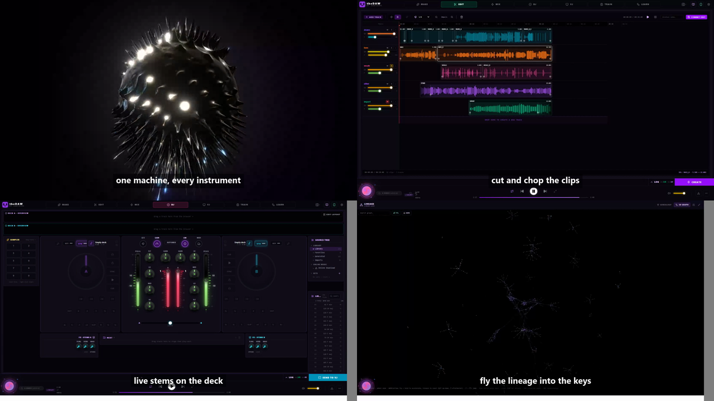
  </a>
  <br>
  <sub><em>▶ Click to watch the full feature tour — also available <a href="showcase/clips-recorded/_showcase_v.mp4">vertical (9:16)</a></em></sub>
</p>

<p align="center">
  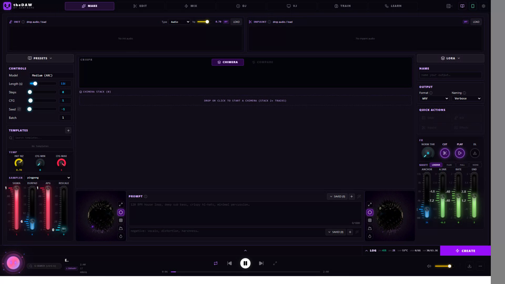
</p>

---

## Repository Structure

| Component | Location | Description |
|---|---|---|
| **Upstream ML pipeline** | `stable_audio_3/` | DiT diffusion transformer, SAME autoencoder, all samplers, LoRA training and inference, distribution-shift schedules. |
| **FastAPI backend** | `backend/server.py` | Async HTTP wrapper. It runs a generation job queue, FFmpeg audio processing, and model introspection on port 8600. |
| **Backend modules** | `backend/modules/` | Plugin system. Each subdirectory provides `module.json` and `router.py`, and the loader mounts every enabled module and isolates failures. The repo ships `analysis`, `chimera`, `controllervision`, `effects` (at `/api/studio`), `library`, `midi`, `notation`, `settings`, `stems`, `vj`, and `ytimport`, plus cloud and real-time generation (`suno`, `magenta`) and the six-family Edit Tool Stack under `/api/edit/*` (mastering, restoration, enhance, delivery, creative-fx, creative-neural). |
| **theDAW interface** | `frontend/` | React 19, Vite 6, Tailwind 4, Zustand 5. Seven workspaces (MAKE, EDIT, MIX, DJ, VJ, TRAIN, LEARN) plus the library, the Catalogue, the analyzer, and the live tools. It proxies `/api/*` to the backend on port 5173 in development. |

---

## Quick Start

```powershell
.\start-dev.bat
```

The launcher kills stale processes on ports 5173 and 8600, starts the backend, waits for it to bind, then starts Vite and opens `http://localhost:5173`.

Manual launch:

```bash
uv run uvicorn backend.server:app --host 0.0.0.0 --port 8600 --reload   # backend
cd frontend && npm run dev                                              # frontend
```

Dependencies install with `uv sync` and `cd frontend && npm install`. On Windows, `uv sync` installs CUDA 12.8 torch and torchaudio plus the pre-built Flash Attention wheel automatically. On Linux, install the matching CUDA wheel index manually, for example `uv pip install torch==2.7.1 torchaudio==2.7.1 --index-url https://download.pytorch.org/whl/cu126`. [§3 of the User Guide](docs/USER_GUIDE.md#3-installation) has full installation details.

---

## Inference Modes (Python)

```python
from stable_audio_3 import StableAudioModel
pipe = StableAudioModel.from_pretrained("medium")

# Text-to-audio
audio = pipe.generate(prompt="Lo-fi boom bap meets orchestral strings, 84 BPM", duration=180)

# Audio-to-audio. init_noise_level sets how far the result departs from the source.
audio = pipe.generate(init_audio=torchaudio.load("in.wav"), init_noise_level=0.9,
                      prompt="bossa nova bassline", duration=30)

# Inpainting and continuation. The mask seconds set the window to regenerate.
audio = pipe.generate(inpaint_audio=torchaudio.load("in.wav"),
                      inpaint_mask_start_seconds=4.0, inpaint_mask_end_seconds=8.0,
                      prompt="punchy kick drum fill", duration=30)
```

For continuation, `inpaint_mask_start_seconds` takes the source length and `duration` takes the desired total. [docs/workflows/autoencoder.md](docs/workflows/autoencoder.md) covers the standalone autoencoder (`AutoencoderModel.from_pretrained("same-l")` with `.encode()` and `.decode()`).

---

## Models

| Key | Flavor | Params | Autoencoder | Hardware | Max Duration |
|---|---|---|---|---|---|
| `small` | ARC | 433 M | SAME-S | CPU | 120 s |
| `medium` | ARC | 1.4 B | SAME-L | GPU (CUDA) | 380 s |
| `small-rf` / `medium-rf` | RF | 433 M / 1.4 B | SAME-S / SAME-L | CPU / GPU | 120 / 380 s |
| `same-s` / `same-l` | Autoencoder | 266 M / 1.7 B | n/a | CPU / GPU | n/a |

ARC checkpoints are post-trained for 8-step inference at `cfg_scale=1`. RF checkpoints are rectified-flow bases for LoRA training at `cfg_scale=7` and roughly 50 steps. ARC and RF checkpoints bundle the autoencoder, and standalone SAME checkpoints reuse the cached full checkpoint when one is available.

---

## Feature Summary

Every feature has a full reference in the [User Guide](docs/USER_GUIDE.md). This is the index.

### MAKE generation

<p align="center">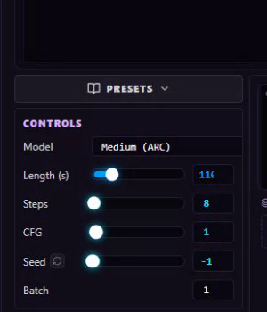</p>

One form drives text-to-audio, audio-to-audio, inpainting, and continuation. Supplied init audio, a text prompt, a painted inpaint region, and a Chimera stack all condition the same generation. The init audio accepts a voice recording from the built-in microphone recorder, an imported audio file, a clip from the media bucket or library, or a pattern rendered to a clip from the piano roll or step sequencer, and the init noise level sets how far the result departs from it. Controls cover duration, batch size, sampler steps, CFG, one-click seed reroll, and init noise level, and the model selector adjusts steps and CFG for RF variants on its own. Chimera blends several clips into one generation and beat-aligns them to a target tempo, automatic or fixed, under Start, Downbeat, or Phrase Weave alignment. Inpainting marks a region on a WaveSurfer preview. The Advanced Generation Panel holds output settings, and Quick Actions route a render to the editor, the init slot, or the inpaint module. Templates store full parameter sets, Saved Prompts keep a history, and the magic-prompt and sparkles buttons seed and optimize prompt text. The Spectrogram Viewer renders Mel, STFT, Chromagram, and CQT. The async job queue polls `/api/jobs/{id}`, supports a binary abort, and saves every render to the library.

### Generate, cloud and real-time

<p align="center">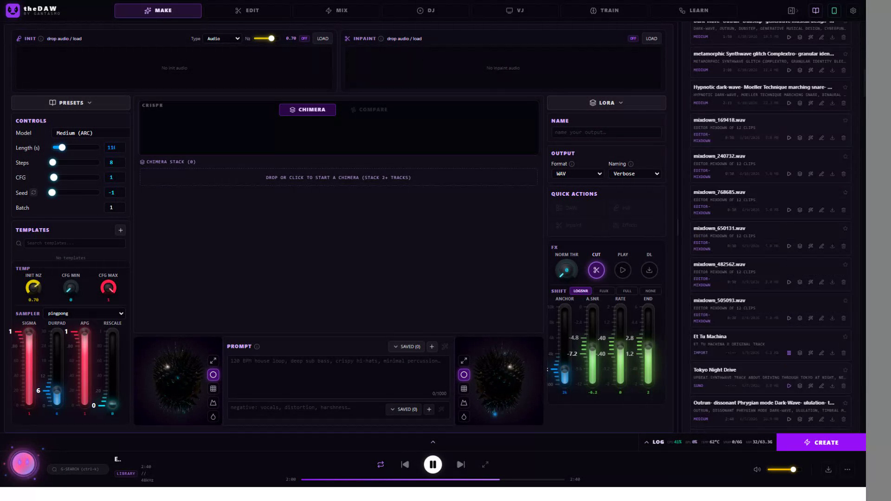</p>

Suno cloud generation runs in the Aurora Cloud Console across simple, custom, cover, and mashup modes. The server-side key stays on the backend, finished tracks become library entries, and cover and mashup results write lineage edges. Magenta RealTime 2 provides text-to-music whenever its sidecar is running. theDAW vendors the first non-Mac MRT2 port in `sidecars/magenta-rt2-nvidia`, which removes the upstream macOS-only CMake guard so the model runs on Windows with WSL2 and NVIDIA, on native Linux, and on cloud GPUs. The extended sidecar also accepts MIDI-note and audio-style conditioning.

### EDIT multi-track editor

<p align="center">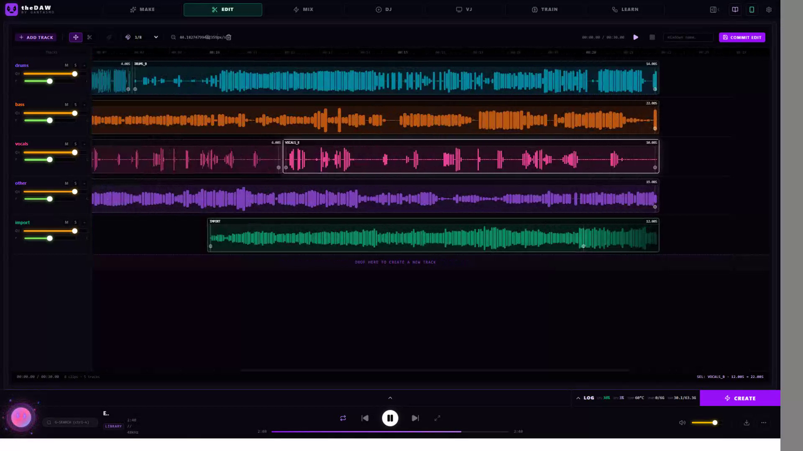</p>

The timeline holds many tracks, and each clip computes and caches its own waveform peaks. Move drags clips along the timeline and between tracks, and Cut splits a clip while preserving source alignment. The snap grid offers Off, 1/4, 1/8, and 1/16 divisions, and zoom spans 5 to 400 px/s. Each track carries an editable name, mute, exclusive solo, volume, pan, and removal, and the live mixer applies those faders, pan, mute, and solo during playback. Each clip exposes left and right trim handles and fade-in and fade-out handles. Inpaint from editor crops the visible region and sends it to the backend. Commit Edit renders the audible tracks into one 44.1 kHz stereo WAV through `OfflineAudioContext`, applying fades, volume, and stereo pan, then saves and downloads the result. The status bar shows timecode and clip and track counts, and Preview auditions the selected clip.

### MIX effects, mastering, and the Edit Tool Stack

<p align="center">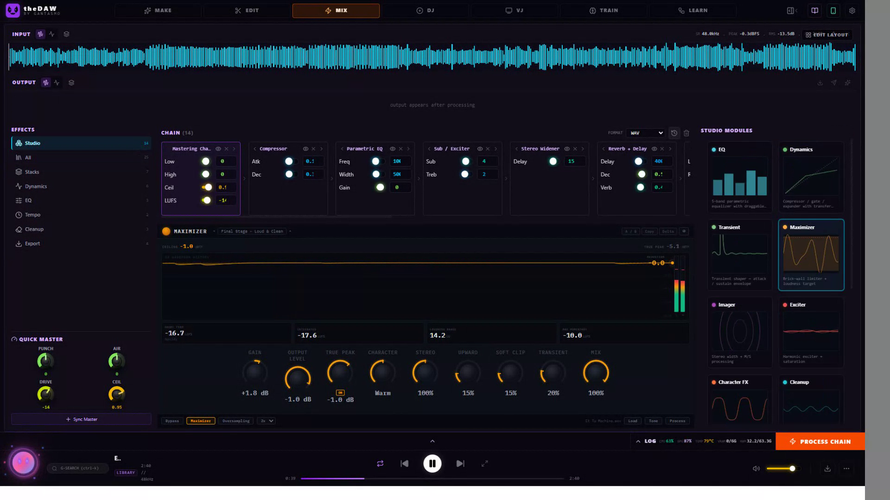</p>

A chain of 24 FFmpeg effects covers a mastering chain, compression, highpass and lowpass filters, volume, tempo, vocal processing, lo-fi vinyl, stereo widening, reverb, delay, a sub exciter, phase isolation, parametric mid EQ, LUFS normalization, pitch shift, echo, fade, declick, silence removal, denoise, and export to FLAC, MP3, AAC, and Opus. Four macro sliders (Drive, Width, Air, Punch) map onto the active effect. Process history keeps the last eight runs, and any prior output promotes back to the current source. The Edit Tool Stack adds six module families under `/api/edit/*` (mastering, restoration, enhance, delivery, creative-fx, creative-neural) whose GUIs iframe into the effect stage.

### DJ performance console

<p align="center">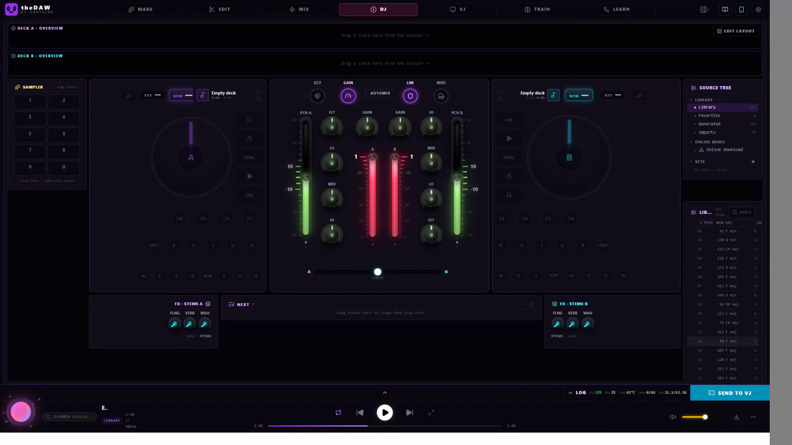</p>

Two decks run from a pro layout with jog wheels, a central mixer, scrolling waveform overviews, and a track browser, loading from the library, a saved set, or an online import. The engine handles octave-aware beatmatch sync with a continuous lock, key-lock, a 3-band EQ, a single-knob filter, and channel trim with auto-gain. Performance controls cover four hotcues, beat loops, momentary loop rolls, slip mode, beat jumps, and quantize. The FX rack adds a flanger, an impulse-response reverb, and a resonant wah per deck, with a master limiter on the DJ bus. Live stems ride on per-stem faders, and cue output pre-listens a deck through a headphone device chosen with `setSinkId`. Automix sequences and crossfades the set on its own, a ten-pad sampler bank fires one-shots, and a Next staging lane queues upcoming tracks. Design Mode turns the console into a hand-arranged layout that persists and exports.

### VJ visual engine

<p align="center">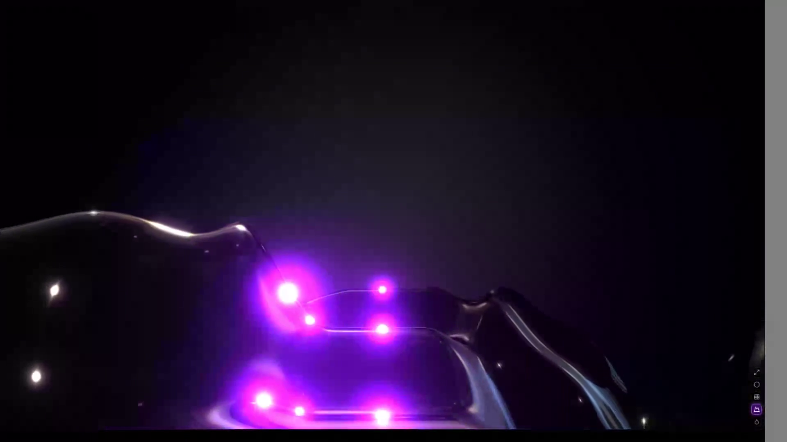</p>

A 3D reactive visualizer renders a glowing spectrogram terrain with bloom, particles, fog, and shader effects, with several camera flight modes and color themes. The signal comes from the session audio, a microphone, MIDI, or a set sent from the DJ tab, and the visualizer pops out into a floating window for a second screen. The camera input accepts any camera the browser can open. It captures a local webcam or capture card, a phone or tablet camera on the same Wi-Fi through the LAN URL and QR code, and off-network devices including Quest 3 headsets through the Mobile Access External URL override (a Cloudflare tunnel or other public URL). HDMI capture cards, DSLRs in webcam mode, and virtual cameras all appear as selectable sources.

### TRAIN LoRA

<p align="center">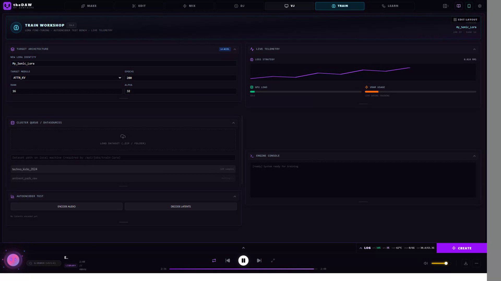</p>

Eight adapter types are available: `lora`, `dora-rows`, `dora-cols`, `bora`, and their `-xs` variants. Layer filtering runs through `--include` and `--exclude` with bracket-range expansion such as `layers[0-11]`. Inference exposes runtime strength, per-LoRA interval gating within a sigma range, and a per-LoRA layer filter, and adapters stack additively. Pre-computed SVD bases (`--svd_bases_path`) speed startup for the `-XS` variants, and `--base_precision bf16` lowers VRAM use. Some training endpoints return HTTP 501 today, and the UI shows a specific message for that status.

### LEARN genealogy graph and visualizations

<p align="center">
  
  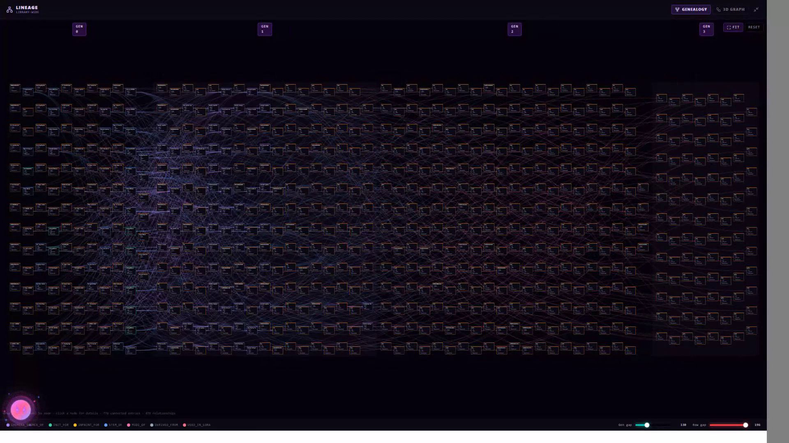
</p>

Every track and the relationships between them render as an interactive force-directed graph in 3D and 2D through `react-force-graph` and three.js, alongside a layered SVG DAG. Edges trace how a piece descended from its sources, so a remix, an inpaint, a stem split, a Chimera blend, and a Suno cover each show their parentage. The camera flies through the graph, focuses a node, and opens any track from its node. theDAW carries other rich visualizations alongside it: the four-mode spectrogram viewer, the real-time spectral analyzer with oscilloscope, spectrum, and radial modes and RMS and peak meters, wavesurfer.js waveforms, a three.js and GLSL cymatics visualizer, and the DJ jog wheels and beatgrids.

### Library and Catalogue

<p align="center">
  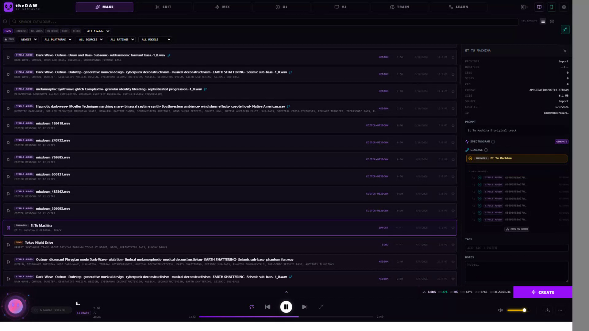
  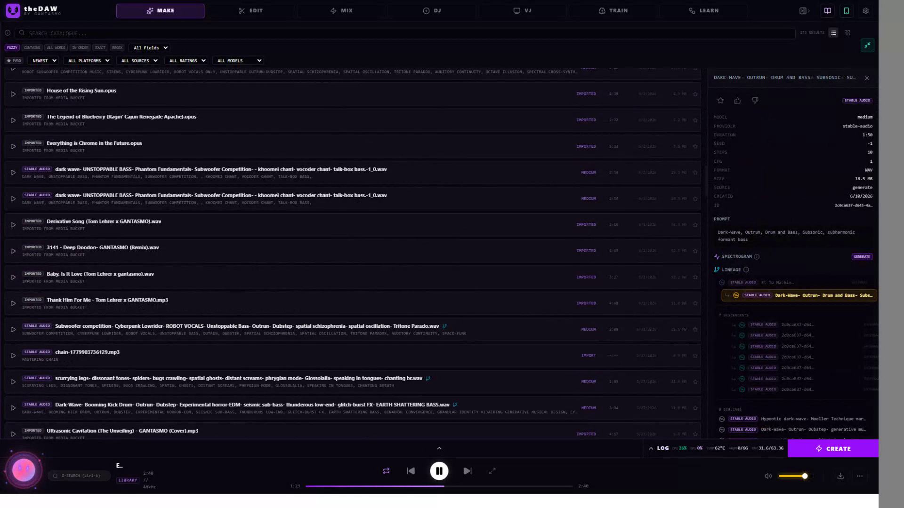
</p>

The library lives on the backend, with audio on disk, metadata in `data/library.db`, and access over `/api/library/*`. Every render saves automatically with its prompt, model, duration, steps, CFG, seed, MIME type, and timestamp. List and grid views, full-text search, a favorites filter, and sorting by newest, duration, or title organize the collection, and each row plays inline with download, delete, favorite, and send-to-editor actions plus a details panel. The Catalogue view adds a cross-provider gallery with provider badges, an inspector with on-demand spectrograms, and a lineage panel, and it runs Suno cover and mashup from any entry.

### Bottom panel tools

<p align="center">
  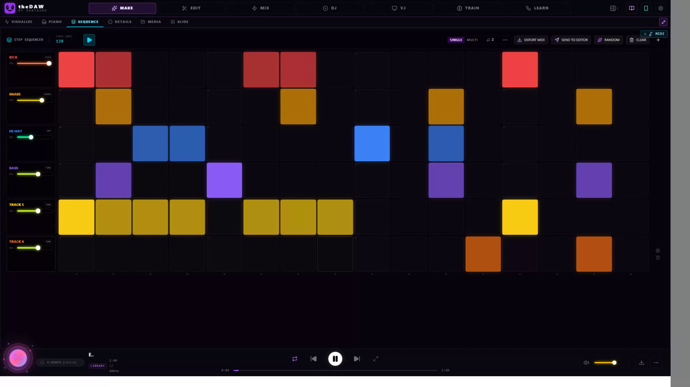
  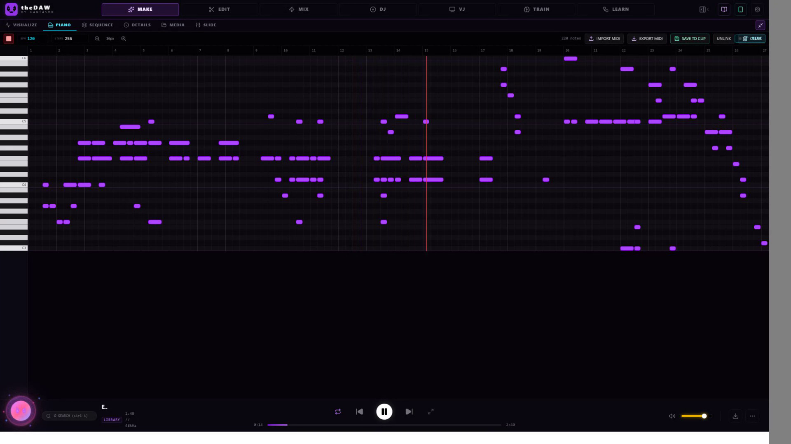
  <br>
  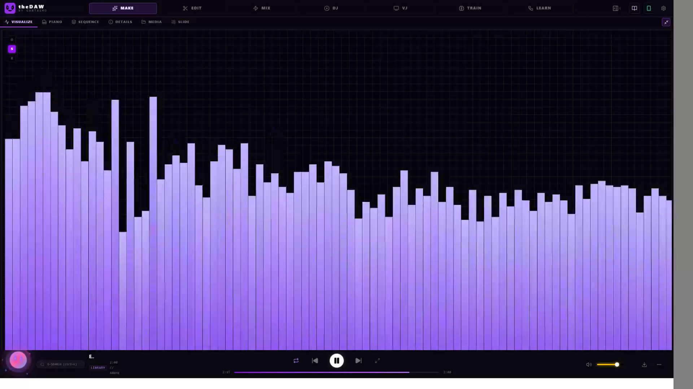
  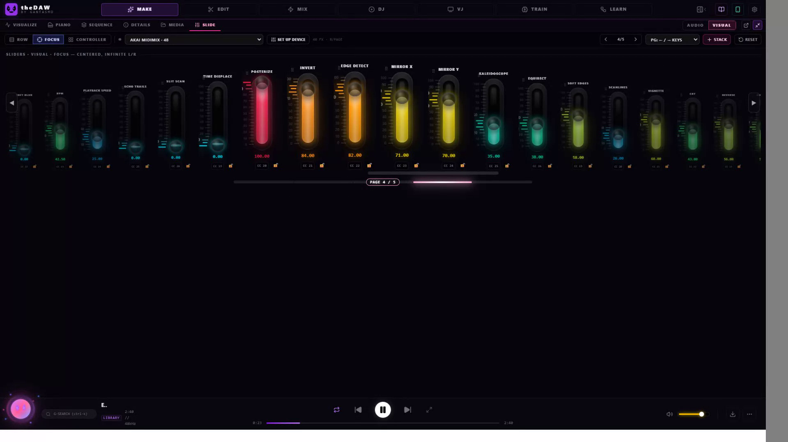
</p>

The spectral analyzer shows oscilloscope, spectrum, and radial modes with RMS and peak meters, a LIVE indicator, and a fullscreen toggle. The piano roll edits MIDI-style notes, imports and exports MIDI, and renders to the editor. The step sequencer runs a 16-step drum machine at 40 to 240 BPM with five synthesized voices, random fill, and render-to-editor. The media bucket holds session audio in WAV, MP3, FLAC, OGG, AAC, M4A, and Opus. SLIDE presents a glass surface of faders and knobs synced with the VJ engine and the audio. Details shows the selected library entry, and Score renders a track's notation, tabs, and arrangements (below).

### Notation, score, tabs, and prompt inference

<p align="center">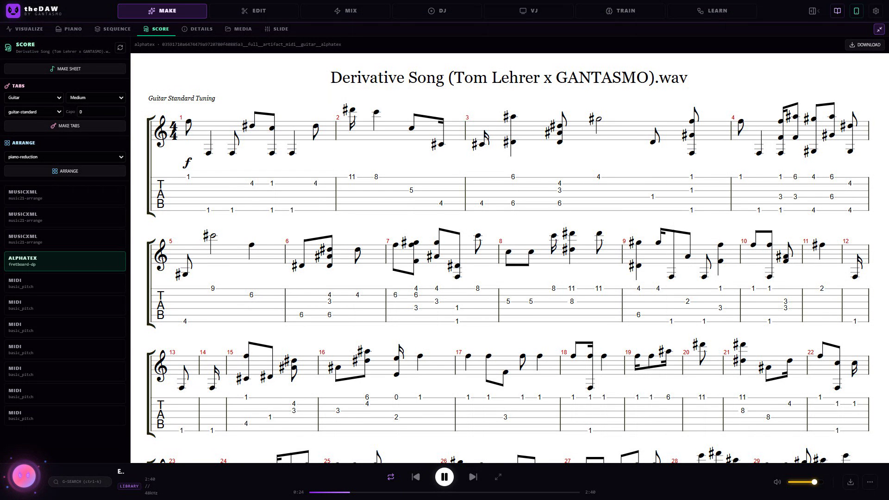</p>

The Score tab turns a track's MIDI into symbolic music. MAKE SHEET converts the first MIDI to MusicXML with music21 and renders it as standard notation through OpenSheetMusicDisplay. The Tabs section arranges guitar or bass tablature for a chosen tuning, capo, and difficulty, placing each note on the string and fret that minimizes hand travel through a dynamic-programming pass, and renders interactive tablature with alphaTab. Arrange builds a lead-sheet, piano-reduction, simplified, or band-score MusicXML from the track's MIDIs. Scores export to ABC, and to PDF and SVG when MuseScore is installed. Every symbolic file is a notation artifact (midi, musicxml, abc, alphatex, pdf, svg) stored per track with lineage to its source. In the Details panel, PROMPT INFERENCE derives a Stable Audio prompt and semantic tags from a track's analysis (tempo, key, energy, timbre, length), and USE AS PROMPT drops the text into the MAKE form.

### MIDI mapping and Controller Vision
Controller recognition identifies hardware across three tiers: a library of roughly 110 device profiles, a scored auto-detect that matches an unknown rig to the closest profile, and a learn-by-capture mode that binds a control the moment it moves. The DJ tab maps CC and note messages to deck, mixer, and hotcue actions. Controller Vision detects and identifies a controller from a photo through OpenCV and a vision LLM, including a LAN phone-pairing capture flow. Photo-driven layout inference is planned.

### Player footer, processing log, and assistant
The footer stays across every tab with the current title, a model or status chip, total duration, transport, a seek bar with hover scrubber, a volume slider, and a download button, and it hands off to the active editor timeline. The processing log is a 500-entry ring buffer with leveled, color-coded lines and export and clear controls. The assistant orb streams chat from any configured provider, including Claude Code over the CLI, Gemini, Anthropic, OpenAI, Grok, Groq, OpenRouter, Ollama, LM Studio, llama.cpp, and vLLM, with live model lists, a hashed multi-key pool, attachments, and RAG over the docs through ChromaDB.

---

## Python API

```python
pipe = StableAudioModel.from_pretrained("medium")
pipe.load_lora("style.safetensors", weight=0.8)               # stacks additively
audio = pipe.generate(
    prompt="...", duration=30,
    sampler_type="dpmpp_2m_sde",   # euler | rk4 | dpmpp_2m_sde | ping_pong
    apg_scale=1.0,                 # Adaptive Projected Guidance
    cfg_interval=(0.0, 1.0),       # apply CFG only within this sigma range
    sigma_max=1.0,                 # max noise level for partial trajectories
)
```

Runtime LoRA strength changes through `set_lora_strength(model, 0.5, lora_index=0)`. [docs/workflows/lora.md](docs/workflows/lora.md) has the full adapter-type and layer-filter reference.

---

## Documentation Index

| Document | Contents |
|---|---|
| [docs/USER_GUIDE.md](docs/USER_GUIDE.md) | The complete manual covering every feature, control, and endpoint, rendered in-app by the Docs button. |
| [docs/guides/prompting.md](docs/guides/prompting.md) | Prompt structure, conditioning signals, and style reference. |
| [docs/guides/SUNO_EXTERNAL_API.md](docs/guides/SUNO_EXTERNAL_API.md) | Suno cloud-generation API reference covering modes, polling, and usage. |
| [docs/guides/model-overview.md](docs/guides/model-overview.md) | Architecture design and model comparison. |
| [docs/guides/notation-and-score.md](docs/guides/notation-and-score.md) | Audio to MIDI, sheet music, tabs, arrangements, and prompt inference. |
| [docs/workflows/inference.md](docs/workflows/inference.md) · [lora.md](docs/workflows/lora.md) · [autoencoder.md](docs/workflows/autoencoder.md) | Inference modes, LoRA adapters and training, and the standalone autoencoder. |
| [docs/windows/setup-guide.md](docs/windows/setup-guide.md) · [troubleshooting.md](docs/windows/troubleshooting.md) | Windows installation (CUDA, Flash Attention, soundfile) and fixes. |

---

## Self-documenting

theDAW generates its own documentation and promo material from the live app. `scripts/screenshots/` drives a real session to capture feature screenshots and a feature-vs-documentation coverage report (`npm --prefix frontend run screenshots`), and `frontend/_capture_clips.mjs` is a Playwright harness that records the running app through every feature into the feature-tour video that `showcase/build_roughcut.sh` stitches in 16:9 and 9:16. The feature images above are frames from that capture. The in-app assistant answers from these same documents through a ChromaDB RAG index, so the docs, the video, and the assistant all stay sourced from one place.

---

## Troubleshooting

**Static glitch output on the Medium model.** Flash Attention is not installed correctly. Verify it with `uv run python -c "from flash_attn import flash_attn_func; import flash_attn; print(flash_attn.__version__)"` and reinstall a wheel matching the Python, torch, and CUDA combination from [kingbri1/flash-attention](https://github.com/kingbri1/flash-attention/releases).

**"API UNREACHABLE" banner.** The backend is not listening on port 8600. Test it with `curl http://localhost:8600/api/health`. On Windows, `.\start-dev.bat` clears stale processes automatically.

**Out-of-memory on the Medium model.** The Medium pipeline requires approximately 8 GB VRAM. The `small` model, a shorter `duration`, or freeing competing CUDA processes resolves it.

**Library slow or failing to save.** Confirm the backend is running on port 8600, since the list loads once it reports ready, and free disk space if writes begin to fail.

[§23 of the User Guide](docs/USER_GUIDE.md#23-troubleshooting) has the full matrix.

---

## Credits

theDAW was built by **[GANTASMO](https://github.com/gantasmo)** as part of the [Music Hackspace](https://musichackspace.org) Music Technology Hackathon at [Berklee College of Music](https://www.berklee.edu).

Special thanks to [Music Hackspace](https://musichackspace.org), [Berklee College of Music](https://www.berklee.edu), and to Zack, CJ, Jordi, Zach, and Matt from [Stability AI](https://stability.ai) for their continued help and support.

### Built with

- **[Stability AI](https://stability.ai)** provides Stable Audio 3 and [stable-audio-tools](https://github.com/Stability-AI/stable-audio-tools), the diffusion model and pipeline at the core of theDAW.
- **[Magenta](https://github.com/magenta)** RealTime by **[Google DeepMind](https://deepmind.google)** brings real-time music generation, running through theDAW's own [NVIDIA/CUDA port](sidecars/magenta-rt2-nvidia/), the first and only non-Mac port so far.
- **[Suno](https://suno.com)** powers cloud music generation.
- **[T5Gemma](https://huggingface.co/google/t5gemma-b-b-ul2)** by Google handles text conditioning.
- **[Demucs](https://github.com/facebookresearch/demucs)** by Meta AI handles stem separation, and **[basic-pitch](https://github.com/spotify/basic-pitch)** by Spotify handles audio-to-MIDI transcription.
- **[music21](https://github.com/cuthbertLab/music21)** by MIT builds MusicXML, ABC, tabs, and arrangements, **[alphaTab](https://www.alphatab.net)** and **[OpenSheetMusicDisplay](https://opensheetmusicdisplay.org)** render tablature and scores in the browser, and **[MuseScore](https://musescore.org)** engraves PDF and SVG.
- **[MLX](https://github.com/ml-explore/mlx)** by Apple is the inference core the Magenta port builds on, extended here with a CUDA backend.
- **[PyTorch](https://pytorch.org)**, **[FFmpeg](https://ffmpeg.org)**, **[three.js](https://threejs.org)**, **[react-force-graph](https://github.com/vasturiano/react-force-graph)**, **[WaveSurfer.js](https://wavesurfer.xyz)**, **[React](https://react.dev)**, **[Vite](https://vitejs.dev)**, and **[Tailwind CSS](https://tailwindcss.com)** carry the rest, alongside the wider open-source community.

Corrections and additions to this list are welcome through a GitHub issue.

---

## License

Commercial use of these models is governed by the [Stability AI Community License](https://stability.ai/license).
