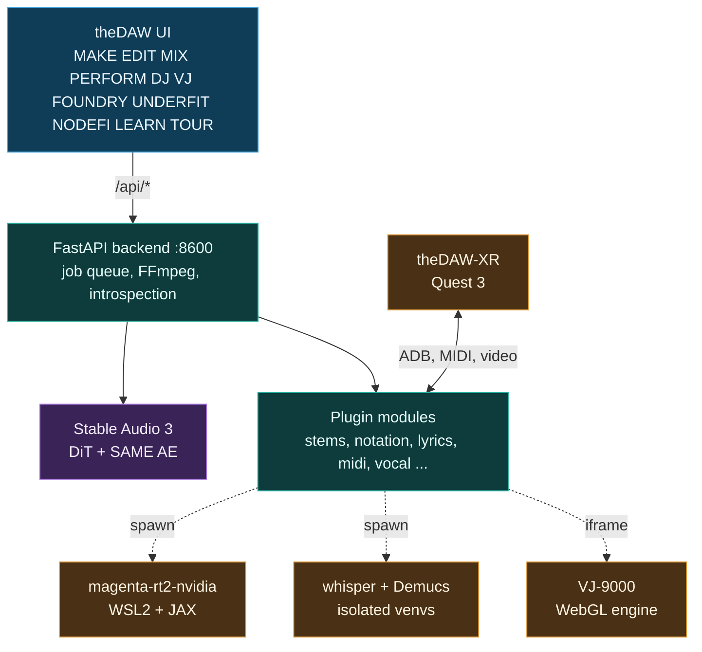
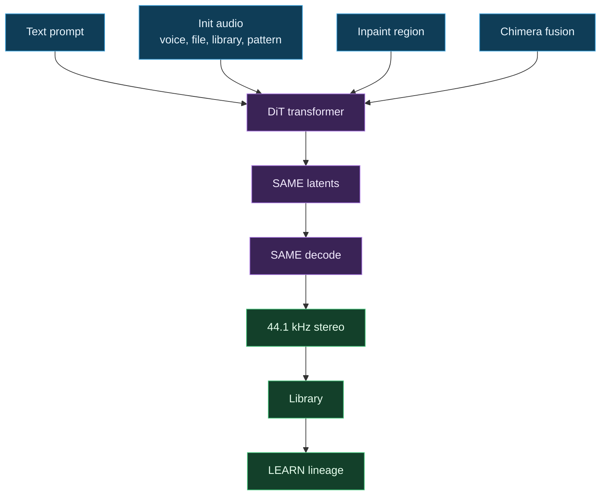
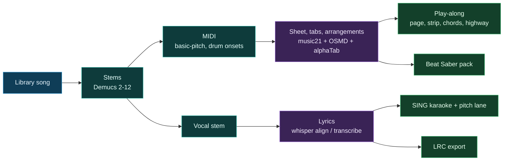

<h1 align="center">theDAW</h1>

<p align="center"><strong>by <a href="https://gantasmo.com">GANTASMO</a></strong></p>

<p align="center">
  <a href="https://www.python.org/"></a>
  <a href="https://pytorch.org/"></a>
  <a href="https://react.dev/"></a>
  <a href="https://fastapi.tiangolo.com/"></a>
  <br>
  
  
  <a href="https://github.com/gantasmo/theDAW-XR"></a>
  
</p>

<p align="center">
  <a href="https://open.spotify.com/artist/4q5n0QgK6mvyuw8FRzhuNA"></a>
  <a href="https://www.youtube.com/@GANTASMO"></a>
  <a href="https://www.instagram.com/gantasmo"></a>
  <a href="https://x.com/gantasmo"></a>
  <a href="https://gantasmo.com"></a>
</p>

---

**theDAW is a free music studio that runs on your own machine.** Make a track from a text prompt or from your own audio, arrange and mix it, turn it into sheet music, sing along to it, DJ it, and put live visuals behind it, all in one app. Nothing is uploaded, nothing needs a subscription, and every model stays under your control.

<p align="center">
  
</p>

## Get started

1. **Install.** On Windows, double-click `theDAW.bat`. It checks the machine, installs anything missing after one confirmation, and opens theDAW in the browser. On Linux or macOS run `./theDAW.sh`. Prefer an installer? Every [release](https://github.com/gantasmo/theDAW/releases) ships a Windows installer, a macOS disk image, a Docker image, and there is a [Pinokio launcher](docs/guides/pinokio-launcher.md).
2. **Make something.** Type a prompt in MAKE and press CREATE. Models never download on their own: allow the download once in **Settings → Models** and the first CREATE fetches what it needs (the `small` model runs on CPU, `medium` wants an NVIDIA GPU).
3. **Keep going.** Right-click the new track in the library to send it to EDIT, MIX, SCORE or SING, or drop it on a DJ deck. The orb in the corner answers questions from the manual.

> New here? The in-app **TOUR** walks every workspace. The [User Guide](docs/USER_GUIDE.md) is the full reference when you need a detail.

## What's inside

| Workspace | What it does |
|---|---|
| **MAKE** | Text-to-audio, audio-to-audio, inpainting and continuation from one form, plus **Chimera**, which fuses several clips into one coherent piece. Cloud Suno and real-time Magenta engines sit in the same picker. |
| **EDIT** | A multitrack timeline: waveforms, cut and move, fades, automation, a per-track mixer, insert effects, and a render to one WAV. |
| **MIX** | Mastering and effects: a 25-effect chain with a control panel for every effect, Quick Master macros, VST3 hosting, `.gan` web-plugins, LUFS metering. |
| **SCORE** | Audio to MIDI to notation: sheet music, tabs, arrangements, drum notation, and **play-along** views that follow the track (page, strip, chords, note highway), with Beat Saber export. |
| **SING** | Karaoke for any song: lyrics follow the track word by word, tap the timing yourself or let whisper align it, import and export LRC, and score your pitch against the melody. |
| **DJ** | Two decks with beatmatch sync, key-lock, hotcues, loops, live stems, an FX rack, Automix and a sampler. |
| **VJ** | The [VJ-9000](https://github.com/gantasmo/VJ-9000) visual engine: reactive terrain, cameras, GLSL shaders, cymatics, a GPU effect chain, recording. |
| **PERFORM** | Play an imported Ableton set or a `.tasmo` project from a live clip grid, with pad FX punches and controller routing. |
| **FOUNDRY** | Design plugin interfaces on an infinite canvas and export them as `.gan` web-plugins. |
| **NODEFI** | Node graphs that chain generation, effects and library sources into pipelines, or run live as a performance surface. |
| **UNDERFIT** | Train LoRA adapters on your own audio and use them at generation time. |
| **LEARN** | The genealogy of your library: every remix, stem split, blend and cover drawn as a 3D or 2D graph. |
| **TOUR** | Plan live dates on a map: venues, promoters, festivals, booking contacts and an optimized route. |

**Free here, subscription elsewhere.** Stem separation up to 12 stems, a full mastering suite, VST3 hosting, an HRTF spatializer (**The Owl**), DJ decks with sync and Automix, audio-to-MIDI with engraving, LoRA training, whisper lyric alignment, and export to essentially every format (WAV, MP3, FLAC, OGG, AIFF, Opus, M4A, MIDI, MusicXML, LRC).

**Found nowhere else.** [theDAW-XR](https://github.com/gantasmo/theDAW-XR) hands-only spatial control on Meta Quest 3; **Chimera** clip fusion; **DRAW**, where gestures become music; native **Audima Sway** motion-controller support; **The Foundry** plugin designer; import of Ableton, Reaper, FL Studio, Audacity, Audition, Bitwig and Resolume projects; the first non-Mac port of Magenta RealTime 2; and sixteen themes plus a custom one built from any image.

---

## A closer look

### MAKE

<p align="center"></p>

One form drives text-to-audio, audio-to-audio, inpainting, and continuation. Init audio, a prompt, a painted inpaint region, and a Chimera stack all condition the same generation, and the init noise level sets how far the result departs from the source. Templates store full parameter sets, saved prompts keep a history, and every render lands in the library. Full reference: [User Guide §6](docs/USER_GUIDE.md#6-make-tab).

<p align="center"></p>

**Chimera** takes several clips, analyzes their tempo and key, and fuses them into one piece: phrases are cut on the beat grid, pitched into a shared key, arranged into an arc, and the seams are healed by the model so nothing stalls or clicks. Full reference: [Chimera](docs/reference/features/03-chimera.md).

### Generate

<p align="center"></p>

Suno cloud generation covers simple, custom, cover and mashup modes, and its results write lineage edges into LEARN. Magenta RealTime 2 runs through theDAW's own [magenta-rt2-nvidia](https://github.com/gantasmo/magenta-rt2-nvidia) port (Windows with WSL2, native Linux, or a cloud GPU), with MIDI-note and audio-style conditioning. Full reference: [User Guide §26](docs/USER_GUIDE.md#26-cloud-generation-suno) and [§27](docs/USER_GUIDE.md#27-magenta-realtime-2).

### EDIT

<p align="center"></p>

The timeline holds many tracks; each clip caches its own peaks, Move drags clips along and between tracks, Cut splits while keeping source alignment, and automation lanes record in WRITE mode. Each track carries mute, solo, volume, pan and insert effects, and Commit Edit renders the audible tracks into one 44.1 kHz stereo WAV. Full reference: [User Guide §7](docs/USER_GUIDE.md#7-edit-tab).

### MIX

<p align="center"></p>

A chain of 25 effects covers mastering, compression, filters, vocal processing, lo-fi, stereo widening, reverb, delay, LUFS normalization and pitch shift, each with its own control panel, and four macro sliders map onto the active effect. VST3 plugins scanned from the standard folders drop into the same chain, and `.gan` web-plugins render in the effect stage. Full reference: [User Guide §8](docs/USER_GUIDE.md#8-mix-tab).

<p align="center">
  
  
</p>

<sub align="center">The Owl and Ares are `.gan` web-plugins that ship with theDAW. Any Foundry design exports to the same format.</sub>

### SCORE

<p align="center"></p>

SCORE turns a track's audio into notation. Convert to MIDI (a drum stem gets its own drum-kit transcription), then MAKE SHEET engraves MusicXML, MAKE TABS arranges guitar, bass or ukulele tablature for a tuning, capo and difficulty, and ARRANGE builds lead-sheet, piano-reduction, simplified or band-score parts, with drums on a real percussion staff and every system fitted to the page. Scores export to PDF, SVG, ABC and MusicXML.

<p align="center">
  
  
</p>

Every score is also a **play-along**. PAGE follows the track with a cursor; STRIP scrolls one endless staff under a now-line you can put left or centre; CHORDS shows guitar, bass or ukulele diagrams from a chord track derived from the lead sheet or estimated from the audio; HIGHWAY is a note highway with notation, block and drum skins. An instrument preset picks the parts and the view for your instrument, a latency calibrator lines the visuals up with your device, and the ink colour is yours to choose. The same chart exports as a **Beat Saber** level pack. Full reference: [Notation and Score](docs/guides/notation-and-score.md).

### SING

<p align="center"></p>

SING is karaoke for any song in the library. Lyrics come from the song's own field (Suno imports carry theirs), a paste, an LRC file, or whisper. **ALIGN** keeps your words and takes the timing from the vocal: whisper listens to the vocal stem (the stemmer runs first when the song has none), every line and word gets a time, and the language is detected automatically or picked from a list. **TAP** stamps the timing by hand while the song plays. The pitch lane draws the analyzed melody and scores what you sing into the microphone. Everything exports as LRC. Whisper runs on the GPU when there is one and falls back to the CPU on its own.

### DJ

<p align="center"></p>

Two decks with jog wheels, a central mixer and a track browser. The engine handles octave-aware beatmatch sync, key-lock, a 3-band EQ, a filter, hotcues, beat loops and rolls, slip and quantize. The FX rack adds flanger, reverb and wah per deck with a master limiter, live stems ride on per-stem faders, cue output pre-listens through a headphone device, and Automix runs a set on its own. Full reference: [User Guide §9](docs/USER_GUIDE.md#9-dj-tab).

### VJ

<p align="center"></p>

The VJ tab embeds the [VJ-9000](https://github.com/gantasmo/VJ-9000) engine: a reactive terrain, cameras (webcam, phone, tablet or Quest over the LAN), a GLSL shader source with fractals and audio-mapped params, an ASCII effect, cymatics, depth-cloud and spectra sources, source banks, a GPU effect chain, Autopilot, BPM sync and MIDI mapping. Takes record to WebM and transcode through the backend. Full reference: [User Guide §10](docs/USER_GUIDE.md#10-vj-tab).

### PERFORM

<p align="center"></p>

PERFORM imports an Ableton set or a `.tasmo` project and plays its scenes and clips from a launch grid, with looping, warp, a mixer and FX. Sway Perform adds pad FX punches, per-song templates and the SwayCommand deck as the assignment surface for a controller. Full reference: [Sway Perform](docs/guides/sway-perform-live.md).

### FOUNDRY

<p align="center"></p>

The Foundry lays out custom plugin interfaces on an infinite canvas. A finished design exports as a `.gan` web-plugin, GANTASMO's portable plugin format, which hosts in the MIX chain next to VST3 plugins and the built-in effects.

### NODEFI

<p align="center"></p>

NodeF.I. is a node-graph editor with two personalities on one canvas. **Run** executes a graph through the AI stack (Stable Audio and Magenta generation, effects, merges, feedback loops) and saves results to the library. **Live** turns the same canvas into a performance surface of stems, racks and routes that needs no model at all. Full reference: [NodeF.I.](docs/guides/nodefi.md).

### UNDERFIT

<p align="center"></p>

Underfit fits LoRA adapters on your own audio: eight adapter types, layer filtering, interval gating and SVD bases. Adapters stack additively at generation time with a runtime strength. The tab builds and repairs its own trainer environment. Full reference: [User Guide §22](docs/USER_GUIDE.md#22-lora-adapter-types).

### LEARN

<p align="center">
  
  
</p>

Every track and the relationships between them render as a force-directed graph in 3D and 2D and as a layered DAG. A remix, an inpaint, a stem split, a Chimera blend and a Suno cover each show their parentage. Full reference: [User Guide §12](docs/USER_GUIDE.md#12-learn-tab).

### Library and Catalogue

<p align="center">
  
  
</p>

The library lives on disk with its metadata in `data/library.db`. Every render saves with its prompt, model and settings; imports keep their lyrics and tags. **SUGGEST** builds a playlist ordered by Camelot harmony and BPM flow, and the Catalogue adds a cross-provider gallery with an inspector, on-demand spectrograms and a lineage panel. Full reference: [User Guide §13](docs/USER_GUIDE.md#13-library) and [§29](docs/USER_GUIDE.md#29-catalogue).

### Bottom panel

<p align="center">
  
  
  <br>
  
  
</p>

Levels meters loudness, true-peak, dynamics and stereo image against a delivery target. The analyzer shows oscilloscope, spectrum and radial modes. The piano roll edits notes and imports and exports MIDI, the step sequencer is a 16-step drum machine with five voices, DRAW turns gestures into generative music, the media bucket stages files and URL imports, SLIDE is a glass control surface, SWAY drives music from camera-tracked movement, and Details, Score and Sing show the selected song. Full reference: [User Guide §14](docs/USER_GUIDE.md#14-step-sequencer) through [§16](docs/USER_GUIDE.md#16-bottom-panel-tabs).

### Controllers, XR, phone, and Tour

Controller recognition covers a library of about 110 device profiles, a scored auto-detect, a learn-by-capture mode, and **Controller Vision**, which identifies a controller from a photo. The Audima Sway motion controller is supported natively. [theDAW-XR](https://github.com/gantasmo/theDAW-XR) turns a Meta Quest 3 into a hands-only surface with hand-tracked MIDI, passthrough video into VJ and co-located multiplayer. A phone web app pairs to the desktop for remote MAKE, transport, DJ and library control. The Tour tab plans live dates on a map with venue, promoter and festival discovery, booking-contact enrichment and an optimized route. Full reference: [User Guide §31](docs/USER_GUIDE.md#31-controller-vision), [§34](docs/USER_GUIDE.md#34-quest-and-xr-integrations), [§41](docs/USER_GUIDE.md#41-tour-tab) and [§42](docs/USER_GUIDE.md#42-mobile-companion-app).

### Footer, log, and assistant

The footer stays across every tab with transport, a seek bar, volume and download. The processing log keeps 500 leveled entries. The assistant orb streams chat from any configured provider (Claude Code over the CLI, Gemini, Anthropic, OpenAI, Grok, Groq, OpenRouter, Ollama, LM Studio, llama.cpp, vLLM) with attachments and RAG over these docs. Full reference: [User Guide §17](docs/USER_GUIDE.md#17-player-footer), [§18](docs/USER_GUIDE.md#18-processing-log) and [§32](docs/USER_GUIDE.md#32-admin-module-and-assistant-key-apis).

---

## Install paths

- **Windows script.** Double-click `theDAW.bat`. It preflights prerequisites, runs `install/setup.ps1` for consent-based tool installation, then launches the backend and the UI in one console. See [docs/windows/setup-guide.md](docs/windows/setup-guide.md).
- **Linux and macOS script.** `./theDAW.sh` does the same job on POSIX systems. See [docs/linux/setup-guide.md](docs/linux/setup-guide.md).
- **Release packages.** Every [GitHub Release](https://github.com/gantasmo/theDAW/releases) ships `theDAW-Setup-<version>.exe`, `theDAW-<version>-arm64.dmg` and `ghcr.io/gantasmo/thedaw`. The installers carry the Electron desktop shell. See [docs/guides/electron-desktop-app.md](docs/guides/electron-desktop-app.md).
- **Pinokio launcher.** Install, start, update and reset from the Pinokio browser. See [docs/guides/pinokio-launcher.md](docs/guides/pinokio-launcher.md) and [theDAW-Pinokio](https://github.com/gantasmo/theDAW-Pinokio).
- **Source checkout.** `git clone --recurse-submodules`, then:

```bash
uv sync --group dev && (cd frontend && npm install)
uv run uvicorn backend.server:app --host 0.0.0.0 --port 8600   # backend  -> :8600
cd frontend && npm run dev                                        # frontend -> :5173
```

### Prerequisites

The launchers install these when a tool is missing. The list is here for manual setups.

| Tool | Role |
|---|---|
| **[uv](https://docs.astral.sh/uv/getting-started/installation/)** | Python environment and package manager. Creates the venv and installs torch and CUDA. |
| **[Node.js](https://nodejs.org/) 20.19+ or 22.12+** | Frontend dev server and the VJ sidecar. |
| **[FFmpeg](https://www.gyan.dev/ffmpeg/builds/)** on PATH | Every audio path: effects, exports, library ingest, MIDI conversion, import. |
| **[Git](https://git-scm.com/)** | Clones the repo. `--recurse-submodules` brings in the Magenta sidecar source. |
| **NVIDIA driver 550+** | Runs the Medium model, Magenta, Demucs and GPU whisper. The Small model and CPU whisper work without it. Turing cards (RTX 20xx, GTX 16xx) are supported. |

---

## Models

| Key | Flavor | Params | Autoencoder | Hardware | Max Duration |
|---|---|---|---|---|---|
| `small` | ARC | 433 M | SAME-S | CPU | 120 s |
| `medium` | ARC | 1.4 B | SAME-L | GPU (CUDA) | 380 s |
| `small-rf` / `medium-rf` | RF | 433 M / 1.4 B | SAME-S / SAME-L | CPU / GPU | 120 / 380 s |
| `same-s` / `same-l` | Autoencoder | 266 M / 1.7 B | n/a | CPU / GPU | n/a |

ARC checkpoints are post-trained for 8-step inference at `cfg_scale=1`. RF checkpoints are rectified-flow bases for LoRA training at `cfg_scale=7` and roughly 50 steps. Nothing downloads at startup: **local only** is on by default, a model loads on the first generation that needs it once downloads are allowed in **Settings → Models**, and checkpoints already on disk register through the same panel or by dropping them into a `models/` folder at the repo root. The gated Stability repositories fall back to a public mirror of the same weights, and a Hugging Face token unlocks the originals. [User Guide §21](docs/USER_GUIDE.md#21-models) has the full download table.

---

## Python API

```python
from stable_audio_3 import StableAudioModel
pipe = StableAudioModel.from_pretrained("medium")

# Text-to-audio
audio = pipe.generate(prompt="Lo-fi boom bap meets orchestral strings, 84 BPM", duration=180)

# Audio-to-audio. init_noise_level sets how far the result departs from the source.
audio = pipe.generate(init_audio=torchaudio.load("in.wav"), init_noise_level=0.9,
                      prompt="bossa nova bassline", duration=30)

# LoRA stacks additively; runtime strength is adjustable.
pipe.load_lora("style.safetensors")
pipe.set_lora_strength(0.8)
audio = pipe.generate(
    prompt="...", duration=30,
    sampler_type="dpmpp",          # euler | rk4 | dpmpp | pingpong
    apg_scale=1.0,                 # Adaptive Projected Guidance
    cfg_interval=(0.0, 1.0),       # apply CFG only within this sigma range
)
```

[docs/workflows/lora.md](docs/workflows/lora.md) covers adapter types and layer filters, and [docs/workflows/autoencoder.md](docs/workflows/autoencoder.md) covers the standalone autoencoder.

---

## Layout and themes

**Change theme.** The hamburger menu opens the Change Theme modal: sixteen themes spanning dark, metallic, paper, pastel and color families, plus a custom mode that builds a theme from any background image. A theme recolors every surface through shared design tokens. The screenshots on this page use **Brushed Steel**; Obsidian is the default.

<p align="center">
  
  
  
  
  
  
</p>

**Edit layout.** The library panel collapses, the right panel resizes, the bottom panel swaps between its tabs, the LEARN graph goes fullscreen, and the DJ tab's Design Mode rearranges the console.

---

## Documentation

| Document | Contents |
|---|---|
| [docs/USER_GUIDE.md](docs/USER_GUIDE.md) | The complete manual covering every feature, control, and endpoint, rendered in-app by the Docs button. |
| [docs/guides/prompting.md](docs/guides/prompting.md) | Prompt structure, conditioning signals, and style reference. |
| [docs/guides/notation-and-score.md](docs/guides/notation-and-score.md) | Audio to MIDI, sheet music, tabs, arrangements, play-along, and prompt inference. |
| [docs/guides/nodefi.md](docs/guides/nodefi.md) | NodeF.I. node graphs: AI pipelines and live performance. |
| [docs/guides/sway-perform-live.md](docs/guides/sway-perform-live.md) | PERFORM, the SwayCommand deck, scenes, punches, and templates. |
| [docs/guides/dj-and-genealogy.md](docs/guides/dj-and-genealogy.md) | DJ console, the genealogy graph, and the watch-link broadcast. |
| [docs/guides/model-overview.md](docs/guides/model-overview.md) | Architecture design and model comparison. |
| [docs/guides/SUNO_EXTERNAL_API.md](docs/guides/SUNO_EXTERNAL_API.md) | Suno cloud-generation API reference. |
| [docs/workflows/inference.md](docs/workflows/inference.md), [lora.md](docs/workflows/lora.md), [autoencoder.md](docs/workflows/autoencoder.md) | Inference modes, LoRA adapters and training, and the standalone autoencoder. |
| [docs/windows/setup-guide.md](docs/windows/setup-guide.md), [troubleshooting.md](docs/windows/troubleshooting.md) | Windows installation and fixes. |
| [docs/linux/setup-guide.md](docs/linux/setup-guide.md) | Linux installation: prerequisites, `./theDAW.sh`, and what differs from Windows. |
| [docs/RELEASING.md](docs/RELEASING.md) | How a release is cut and what CI builds. |

The GitHub **[Wiki](https://github.com/gantasmo/theDAW/wiki)** mirrors this index in a browsable form across theDAW and its sidecars.

---

## Ecosystem

| Project | Repo | Role |
|---|---|---|
| **VJ-9000** | [](https://github.com/gantasmo/VJ-9000) | The WebGL audio-reactive visual engine embedded in the VJ tab and runnable standalone. |
| **magenta-rt2-nvidia** | [](https://github.com/gantasmo/magenta-rt2-nvidia) | The first non-Mac port of Magenta RealTime 2, vendored at `sidecars/magenta-rt2-nvidia`. |
| **theDAW-XR** | [](https://github.com/gantasmo/theDAW-XR) | The Meta Quest 3 spatial companion: hand-tracked MIDI, passthrough streaming, and colocation. |
| **theDAW-Pinokio** | [](https://github.com/gantasmo/theDAW-Pinokio) | The one-click Pinokio launcher. |

---

## Structure

| Component | Location | Description |
|---|---|---|
| **Upstream ML pipeline** | `stable_audio_3/` | DiT diffusion transformer, SAME autoencoder, all samplers, LoRA training and inference, distribution-shift schedules. |
| **FastAPI backend** | `backend/server.py` | Async HTTP wrapper running a generation job queue, FFmpeg audio processing, and model introspection on port 8600. |
| **Backend modules** | `backend/modules/` | Plugin system. Each subdirectory provides `module.json` and `router.py`, and the loader mounts every enabled module and isolates failures: `analysis`, `chimera`, `effects`, `library`, `lyrics`, `midi`, `notation`, `stems`, `vocal`, `suno`, `magenta`, the XR bridges, `foundry`, `underfit`, and the rest. |
| **theDAW interface** | `frontend/` | React 19, Vite 7, Tailwind 4, Zustand 5. Eleven workspaces (MAKE, EDIT, MIX, PERFORM, DJ, VJ, FOUNDRY, UNDERFIT, NODEFI, LEARN, TOUR), the library and Catalogue, and the bottom panel (Levels, Visualize, MIDI, Sequence, DRAW, Score, Sing, Details, Media, SLIDE, SWAY). The dev server on port 5173 proxies `/api/*` to the backend. |
| **Sidecars** | `sidecars/` | The vendored `magenta-rt2-nvidia` port, the `questcast` and `queststitch` Quest bridges, and the `magenta` studio sidecar. Demucs and whisper build their own isolated environments on first use. |

```
theDAW/
|-- theDAW.bat / theDAW.sh   <-- double-click or run to install everything and launch
|-- backend/                 <-- FastAPI server and the plugin modules behind /api/*
|-- frontend/                <-- the React / Vite workspace served at http://localhost:5173
|-- stable_audio_3/          <-- the Stable Audio 3 inference library (DiT, SAME autoencoder, LoRA)
|-- sidecars/                <-- magenta-rt2-nvidia (run Setup-MRT2.bat once), magenta, questcast
|-- electron-ui/             <-- the optional desktop (Electron) shell
|-- install/                 <-- setup.ps1, the consent-based installer theDAW.bat runs
|-- docs/                    <-- the User Guide, setup guides, feature reference, and workflow docs
|-- data/                    <-- created at runtime; your library (gitignored, safe to back up)
|-- models/                  <-- OPTIONAL: drop checkpoint folders here (see Models)
|-- tests/                   <-- the pytest suite
\-- scripts/                 <-- automation that captures the screenshots and the feature tour
```

---

## Architecture

theDAW is a React frontend over a FastAPI backend that wraps the Stable Audio 3 pipeline, a plugin module system, and spawned sidecars. Heavy features load on first use rather than at boot. The wiki [Dataflow](https://github.com/gantasmo/theDAW/wiki/Dataflow) page maps every input and output in one chart.


```mermaid
flowchart TD
  UI["theDAW UI<br/>MAKE EDIT MIX PERFORM DJ VJ FOUNDRY UNDERFIT NODEFI LEARN TOUR"]:::in
  API["FastAPI backend :8600<br/>job queue, FFmpeg, introspection"]:::proc
  SA3["Stable Audio 3<br/>DiT + SAME AE"]:::eng
  MODS["Plugin modules<br/>stems, notation, lyrics, midi, vocal ..."]:::proc
  MRT2["magenta-rt2-nvidia<br/>WSL2 + JAX"]:::side
  WSP["whisper + Demucs<br/>isolated venvs"]:::side
  VJ["VJ-9000<br/>WebGL engine"]:::side
  XR["theDAW-XR<br/>Quest 3"]:::side
  UI -->|/api/*| API
  API --> SA3
  API --> MODS
  MODS -. spawn .-> MRT2
  MODS -. spawn .-> WSP
  MODS -. iframe .-> VJ
  XR <-->|ADB, MIDI, video| MODS
  classDef in fill:#0f3d57,stroke:#3aa0db,color:#eaf6ff;
  classDef eng fill:#3a2356,stroke:#a877e0,color:#f3ecff;
  classDef proc fill:#0e3b3b,stroke:#2bb3a3,color:#e6fffb;
  classDef side fill:#4a3115,stroke:#e09a3a,color:#fff4e3;
```

**Generation.** Several inputs condition one generation; the DiT renders latents, the autoencoder decodes them, every render saves to the library, and LEARN draws the lineage.


```mermaid
flowchart TD
  P["Text prompt"]:::in
  INIT["Init audio<br/>voice, file, library, pattern"]:::in
  MASK["Inpaint region"]:::in
  CHI["Chimera fusion"]:::in
  P --> GEN
  INIT --> GEN
  MASK --> GEN
  CHI --> GEN
  GEN["DiT transformer"]:::eng --> LAT["SAME latents"]:::eng
  LAT --> DEC["SAME decode"]:::eng
  DEC --> WAV["44.1 kHz stereo"]:::out
  WAV --> LIB["Library"]:::out
  LIB --> LRN["LEARN lineage"]:::out
  classDef in fill:#0f3d57,stroke:#3aa0db,color:#eaf6ff;
  classDef eng fill:#3a2356,stroke:#a877e0,color:#f3ecff;
  classDef out fill:#13402a,stroke:#46c47a,color:#e7ffee;
```

**A song, all the way through.** One library entry can be separated into stems, transcribed to MIDI, engraved, played along to, and sung to, and each step is a first-class artifact of the entry.


```mermaid
flowchart LR
  SONG["Library song"]:::in --> STEMS["Stems<br/>Demucs 2-12"]:::proc
  STEMS --> MIDI["MIDI<br/>basic-pitch, drum onsets"]:::proc
  MIDI --> SCORE["Sheet, tabs, arrangements<br/>music21 + OSMD + alphaTab"]:::eng
  SCORE --> PLAY["Play-along<br/>page, strip, chords, highway"]:::out
  SCORE --> BS["Beat Saber pack"]:::out
  STEMS --> VOX["Vocal stem"]:::proc
  VOX --> LYR["Lyrics<br/>whisper align / transcribe"]:::eng
  LYR --> SING["SING karaoke + pitch lane"]:::out
  LYR --> LRC["LRC export"]:::out
  classDef in fill:#0f3d57,stroke:#3aa0db,color:#eaf6ff;
  classDef eng fill:#3a2356,stroke:#a877e0,color:#f3ecff;
  classDef proc fill:#0e3b3b,stroke:#2bb3a3,color:#e6fffb;
  classDef out fill:#13402a,stroke:#46c47a,color:#e7ffee;
```

---

## Automation

theDAW generates its own documentation from the live app. `scripts/screenshots/` drives a real session through every workspace and writes the screenshots on this page and a feature-coverage report, and `frontend/_capture_clips.mjs` records the feature-tour video. The in-app assistant answers from the same documents through a RAG index, so the docs, the video and the assistant stay sourced from one place.

---

## Troubleshooting

**"API UNREACHABLE" banner.** The backend is not listening on port 8600. Test it with `curl http://localhost:8600/api/health`. On Windows, `.\theDAW.bat` clears stale processes automatically.

**Out-of-memory on the Medium model.** The `small` model, a shorter `duration`, or freeing competing CUDA processes resolves it.

**Static or noise from the Medium model on Windows.** Check `GET /api/health` for `flash_attention_active`. On Turing GPUs (RTX 20xx, GTX 16xx) it reads false by design and the model runs on an equivalent fallback. On Ampere or newer with a broken wheel, reinstall a matching wheel from [kingbri1/flash-attention](https://github.com/kingbri1/flash-attention/releases).

[User Guide §23](docs/USER_GUIDE.md#23-troubleshooting) has the full matrix.

---

## About GANTASMO

> **GANTASMO** is an amorphous entity by [Daniel Joaquin Trujillo](https://github.com/danieljtrujillo) and [Josh Valenzuela](https://github.com/StarskreamEXE) that defies conventional classification. We make thought provoking, highly technical, yet listenable music inspired by the underappreciated pioneers of modern music. Beyond musical composition and performance, GANTASMO is a powerhouse of research and development in the fields of Artificial Intelligence, Augmented Reality, Virtual Reality, the democratization of musical tools and education, and the preservation and evolution of musical history and traditions predating modern recording infrastructure.

## Credits

theDAW was built by **[GANTASMO](https://github.com/gantasmo)** as part of the [Music Hackspace](https://musichackspace.org) Music Technology Hackathon at [Berklee College of Music](https://www.berklee.edu).

## Built With

- **[Stability AI](https://stability.ai)** provides Stable Audio 3 and [stable-audio-tools](https://github.com/Stability-AI/stable-audio-tools), the diffusion model and pipeline at the core of theDAW.
- **[Magenta](https://github.com/magenta)** RealTime by **[Google DeepMind](https://deepmind.google)** brings real-time music generation, running through theDAW's own [NVIDIA/CUDA port](https://github.com/gantasmo/magenta-rt2-nvidia).
- **[Suno](https://suno.com)** powers cloud music generation.
- **[T5Gemma](https://huggingface.co/google/t5gemma-b-b-ul2)** by Google handles text conditioning.
- **[Demucs](https://github.com/facebookresearch/demucs)** by Meta AI handles stem separation, **[basic-pitch](https://github.com/spotify/basic-pitch)** by Spotify handles audio-to-MIDI transcription, and **[faster-whisper](https://github.com/SYSTRAN/faster-whisper)** transcribes and aligns lyrics.
- **[music21](https://github.com/cuthbertLab/music21)** by MIT builds MusicXML, ABC, tabs, and arrangements, **[alphaTab](https://www.alphatab.net)** and **[OpenSheetMusicDisplay](https://opensheetmusicdisplay.org)** render tablature and scores in the browser, and **[MuseScore](https://musescore.org)** engraves PDF and SVG.
- **[MLX](https://github.com/ml-explore/mlx)** by Apple is the inference core the Magenta port builds on, extended here with a CUDA backend.
- **[PyTorch](https://pytorch.org)**, **[FFmpeg](https://ffmpeg.org)**, **[three.js](https://threejs.org)**, **[react-force-graph](https://github.com/vasturiano/react-force-graph)**, **[WaveSurfer.js](https://wavesurfer.xyz)**, **[React](https://react.dev)**, **[Vite](https://vitejs.dev)**, and **[Tailwind CSS](https://tailwindcss.com)** carry the rest, alongside the wider open-source community.

Corrections and additions to this list are welcome through a GitHub issue.

## Special Thanks

To [Music Hackspace](https://musichackspace.org) and [Berklee College of Music](https://www.berklee.edu) for hosting the hackathon, and to Zack, CJ, Jordi, Zach, and Matt from [Stability AI](https://stability.ai) for their continued help and support.

---

<p align="center">
  <a href="https://open.spotify.com/artist/4q5n0QgK6mvyuw8FRzhuNA"></a>
  <a href="https://www.youtube.com/@GANTASMO"></a>
  <a href="https://www.instagram.com/gantasmo"></a>
  <a href="https://x.com/gantasmo"></a>
  <a href="https://gantasmo.com"></a>
</p>

<p align="center"><sub>Made by <a href="https://github.com/danieljtrujillo">Daniel Joaquin Trujillo</a> and <a href="https://github.com/StarskreamEXE">Josh Valenzuela</a> as GANTASMO.</sub></p>
