<h1 align="center">theDAW</h1>

<p align="center"><strong>by <a href="https://gantasmo.com">GANTASMO</a></strong></p>

<p align="center">
  <a href="https://www.python.org/"></a>
  <a href="https://pytorch.org/"></a>
  <a href="https://react.dev/"></a>
  <a href="https://fastapi.tiangolo.com/"></a>
  <br>
  
  
  <a href="https://github.com/gantasmo/theDAW-XR"></a>
  
</p>

<p align="center">
  <a href="https://open.spotify.com/artist/4q5n0QgK6mvyuw8FRzhuNA"></a>
  <a href="https://www.youtube.com/@GANTASMO"></a>
  <a href="https://www.instagram.com/gantasmo"></a>
  <a href="https://x.com/gantasmo"></a>
  <a href="https://gantasmo.com"></a>
</p>

---

**theDAW is a free music studio that runs on your own computer.** You can generate a track from a text prompt, edit and mix it, turn it into sheet music, sing along to it with timed lyrics, DJ it, play it live, and run visuals behind it. Everything stays on your machine. There is no account and no subscription.

<p align="center">
  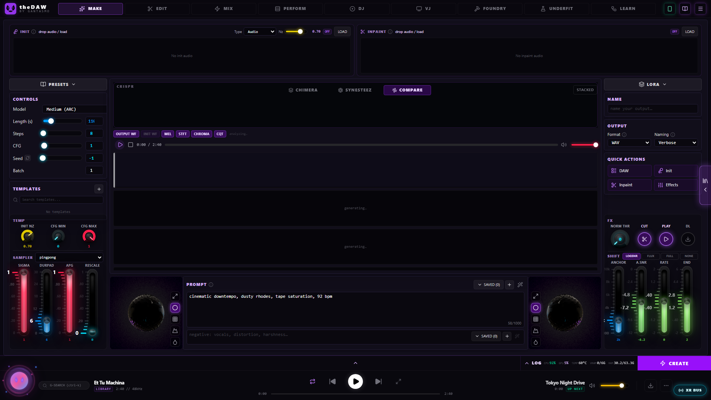
</p>

## Get started

1. **Install.** On Windows, double-click `theDAW.bat`. It checks your computer, asks once before installing anything that is missing, then opens theDAW in your browser. On Linux or macOS run `./theDAW.sh`. Every [release](https://github.com/gantasmo/theDAW/releases) also has a Windows installer, a macOS disk image, a Docker image, and a [Pinokio launcher](docs/guides/pinokio-launcher.md).
2. **Make a track.** Open the MAKE tab, type a prompt, press CREATE. Models do not download by themselves. Allow downloads once in **Settings → Models** and the first CREATE fetches the model it needs. The `small` model runs on a CPU. The `medium` model needs an NVIDIA GPU.
3. **Do more with it.** Right-click the new track in the library to open it in EDIT, MIX, SCORE or SING, or to load it on a DJ deck. The assistant orb in the bottom left corner answers questions about the app from the manual.

> The in-app **TOUR** shows every tab. The [User Guide](docs/USER_GUIDE.md) is the full reference.

## What you can do

| Tab | What it is for |
|---|---|
| **MAKE** | Generate audio from a text prompt, from your own audio, or by filling in a painted region. Chimera combines several clips into one track. Suno (cloud) and Magenta RealTime 2 are in the same model list. |
| **EDIT** | A multitrack timeline. Cut, move and fade clips, record automation, add insert effects per track, and render the arrangement to a WAV file. |
| **MIX** | Mastering and effects. A chain of 25 effects, each with its own control panel, Quick Master knobs, VST3 plugins, `.gan` web-plugins and LUFS metering. |
| **SCORE** | Audio to MIDI to notation. Sheet music, tablature, arrangements, drum notation, and four play-along views that follow the track. Exports a Beat Saber level. |
| **SING** | Lyrics that follow the song word by word. Type or paste lyrics, time them by tapping, or let whisper time them. Imports and exports LRC. Scores your pitch. |
| **DJ** | Two decks with beat sync, key lock, hotcues, loops, live stems, an FX rack, Automix and a sampler. |
| **VJ** | The [VJ-9000](https://github.com/gantasmo/VJ-9000) visual engine: audio-reactive terrain, cameras, GLSL shaders, cymatics, a GPU effect chain, and recording. |
| **PERFORM** | Launch scenes and clips from a grid. Opens Ableton sets and `.tasmo` projects. Pad effects and controller routing. |
| **FOUNDRY** | Design a plugin interface on a canvas and export it as a `.gan` web-plugin. |
| **NODEFI** | Connect generation, effects and library nodes into a graph. Run it as a pipeline or play it live. |
| **UNDERFIT** | Train LoRA adapters on your own audio and use them when generating. |
| **LEARN** | A graph of your library: every remix, stem split, blend and cover, drawn in 3D or 2D. |
| **TOUR** | Plan live dates on a map: venues, promoters, festivals, booking contacts and a route. |

**Included at no cost.** Stem separation up to 12 stems, a mastering suite, VST3 hosting, the HRTF spatializer The Owl, DJ decks with sync and Automix, audio-to-MIDI with engraving, LoRA training, whisper lyric alignment, and export to WAV, MP3, FLAC, OGG, AIFF, Opus, M4A, MIDI, MusicXML and LRC.

**Only in theDAW.** [theDAW-XR](https://github.com/gantasmo/theDAW-XR) hand-tracked control on Meta Quest 3, Chimera clip fusion, DRAW (draw on a canvas to play generative music), native Audima Sway motion-controller support, The Foundry plugin designer, import of Ableton, Reaper, FL Studio, Audacity, Audition, Bitwig and Resolume projects, the first non-Mac port of Magenta RealTime 2, and sixteen themes plus a custom theme built from any image.

---

## How to do each thing

### Generate a track: MAKE

<p align="center">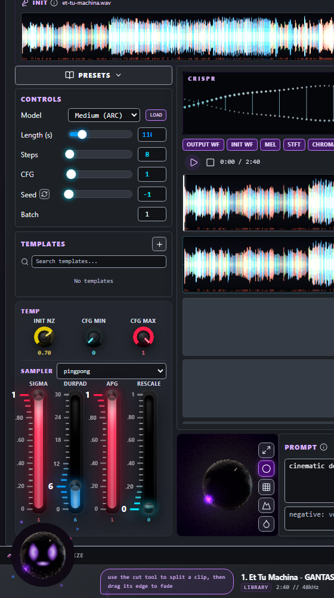</p>

Type a prompt in the PROMPT box and press CREATE. The CONTROLS panel sets the model, the length in seconds, the number of sampler steps, the CFG scale, the seed and the batch size. To generate from your own audio, drop a file on the INIT slot and set the noise level: a low value stays close to the source, a high value moves away from it. To regenerate only part of a track, drop it on the INPAINT slot and paint the region to replace. Templates save a full set of controls, and the SAVED list keeps your prompts. Every result is saved to the library. Reference: [User Guide §6](docs/USER_GUIDE.md#6-make-tab).

<p align="center">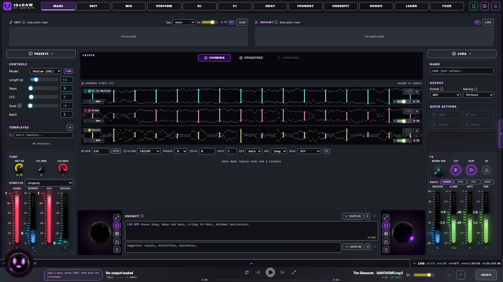</p>

**Chimera** combines several clips into one track. Drop two or more clips on the CHIMERA STACK. Chimera analyzes the tempo and key of each clip, cuts them on the beat grid, pitches them into one key, arranges the pieces into a song, and asks the model to regenerate the joins so they do not click. Reference: [Chimera](docs/reference/features/03-chimera.md).

<p align="center">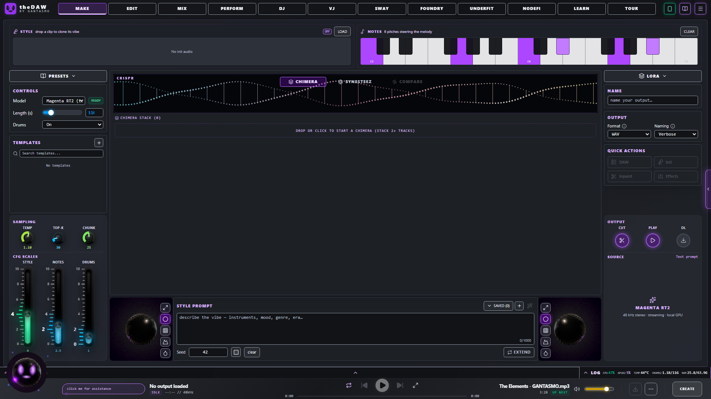</p>

**Suno** generates in the cloud. Pick Suno in the model list for simple, custom, cover and mashup modes. Suno results are saved to the library and drawn in LEARN with their source track. **Magenta RealTime 2** runs through [magenta-rt2-nvidia](https://github.com/gantasmo/magenta-rt2-nvidia), theDAW's own port for Windows with WSL2, native Linux, or a cloud GPU. Steer it with a style clip, MIDI notes on the keyboard, or both. Reference: [User Guide §26](docs/USER_GUIDE.md#26-cloud-generation-suno) and [§27](docs/USER_GUIDE.md#27-magenta-realtime-2).

### Arrange and edit: EDIT

<p align="center">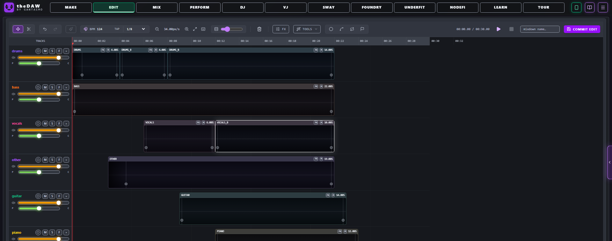</p>

EDIT is a multitrack timeline. Drag clips along a track or onto another track with the Move tool. Split a clip with the Cut tool. Drag a clip's corner handles to set fade in and fade out. Each track has mute, solo, volume, pan and its own insert effects. Turn on WRITE and move a control during playback to record automation. COMMIT EDIT renders every audible track into one 44.1 kHz stereo WAV. Reference: [User Guide §7](docs/USER_GUIDE.md#7-edit-tab).

### Master and add effects: MIX

<p align="center"></p>

Add effects from the EFFECTS list to the CHAIN. Audio flows through the chain from left to right. The 25 effects cover mastering, compression, filters, vocal processing, lo-fi, stereo widening, reverb, delay, LUFS normalization and pitch shift, and each one opens its own control panel. The four QUICK MASTER knobs (PUNCH, AIR, DRIVE, CEIL) set the most common mastering moves in one place. VST3 plugins found in the standard plugin folders appear in the same list, and `.gan` web-plugins open in the effect stage. Press PROCESS CHAIN to render. Reference: [User Guide §8](docs/USER_GUIDE.md#8-mix-tab).

<p align="center">
  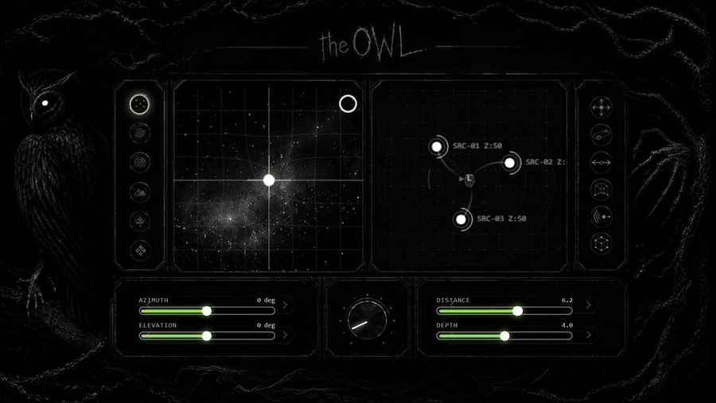
  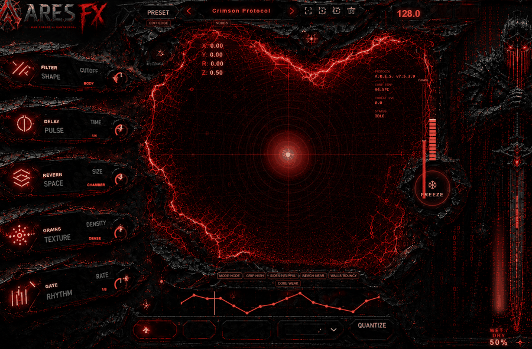
</p>

<sub align="center">The Owl and Ares are `.gan` web-plugins included with theDAW. Any FOUNDRY design exports to the same format.</sub>

### Turn audio into sheet music: SCORE

<p align="center">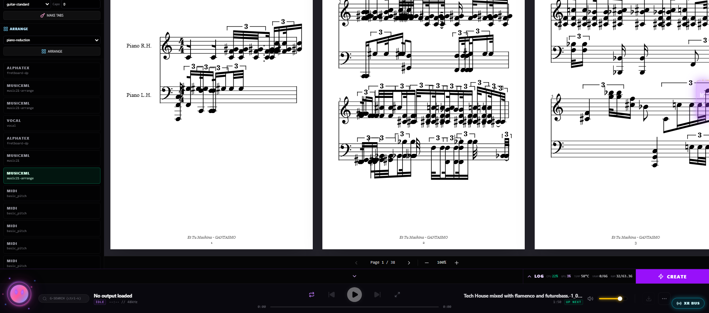</p>

Right-click a track in the library and choose **Convert to MIDI** (a drum stem gets a drum-kit transcription). Then open the SCORE tab in the bottom panel with that track selected:

- **MAKE SHEET** engraves the MIDI as MusicXML sheet music.
- **MAKE TABS** writes guitar, bass or ukulele tablature for a chosen tuning, capo and difficulty.
- **ARRANGE** builds a lead sheet, a piano reduction, a simplified part, or a band score with drums on a percussion staff.
- **MAKE CHORDS** derives a chord track from the lead sheet or estimates one from the audio.

Scores export to PDF, SVG, ABC and MusicXML.

<p align="center">
  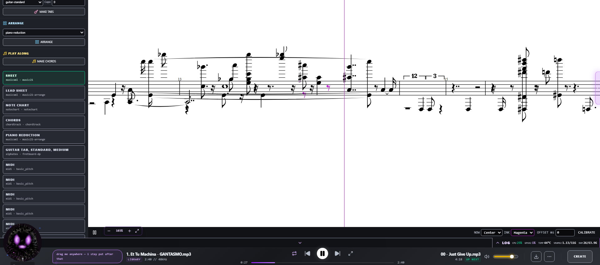
  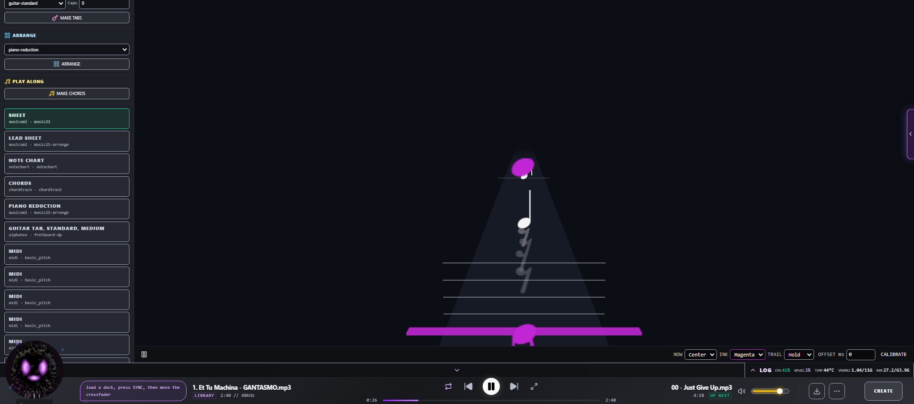
</p>

Every score is also a **play-along**. Press play and the notation follows the track:

- **PAGE** moves a cursor over the engraved pages.
- **STRIP** scrolls one continuous staff under a now-line. The scroll is smooth and moves forward at a steady pace.
- **CHORDS** shows guitar, bass or ukulele chord diagrams from the chord track.
- **HIGHWAY** shows the notes travelling toward a hit line, in a notation, block or drum skin.

The **INSTRUMENT** menu picks the parts and the view for your instrument. **CALIBRATE** measures the delay of your audio device so the notation lines up with the sound. **NOW** puts the now-line at the left or the centre. **INK** picks the colour of the played notes. **TRAIL** decides what happens to a note after it sounds: **Hold** (the default) keeps every played note in the ink colour, so nothing flashes and the score fills in behind the now-line; **Flash** colours only the note that is sounding. Hold is the setting for anyone sensitive to flashing. The same chart exports as a **Beat Saber** level pack. Reference: [Notation and Score](docs/guides/notation-and-score.md).

### Sing with timed lyrics: SING

<p align="center">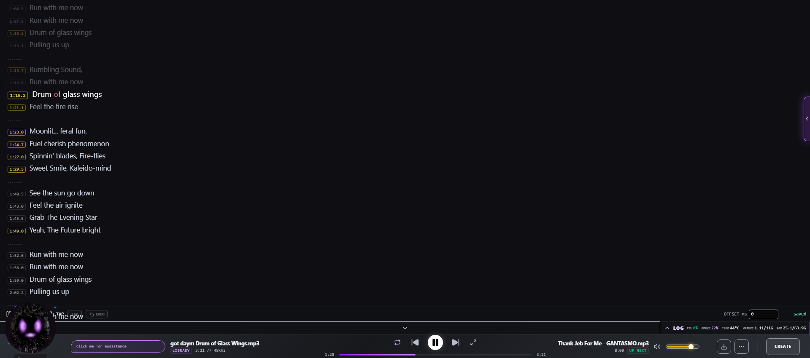</p>

Open the SING tab in the bottom panel with a song selected. Lyrics come from the song's own lyrics field (Suno imports have one), from PASTE LYRICS, from an LRC file through IMPORT, or from whisper through TRANSCRIBE. The text is large and centred. The line being sung is white and slightly bigger, past lines dim, and the word being sung fills from left to right.

To time the lyrics:

- **ALIGN** keeps your words and takes the timing from the vocal. A forced aligner (Meta's MMS aligner, through torchaudio) places every one of your words on the vocal stem, so every line and word gets a start time and no word is ever replaced by a guess. SING runs the stem separator first when the song has no stems. After the timing is saved, whisper listens to the same vocal as a review: a word it heard differently gets an amber underline and the header shows how many words differ. Hover the word to read what whisper heard. You stay the authority on the words; the underline is only a hint to check. Both models run on the GPU when there is one.
- **TAP** times the lyrics by hand. Turn TAP on, play the song, and press Space at the start of each line. Backspace undoes the last tap. The − and + buttons move a line 50 ms earlier or later.
- **OFFSET** shifts every line at once.

**AUTO** (on by default) runs ALIGN by itself when a song opens with lyrics but no timings, and an import with lyrics (a Suno track, a tagged file) is aligned in the background right after its stems, so the song is ready to sing when you open it. **PITCH** shows the melody of the vocal and draws what you sing into the microphone over it. **EXPORT** writes LRC, LRC with word tags, or plain text.

### Mix two tracks: DJ

<p align="center">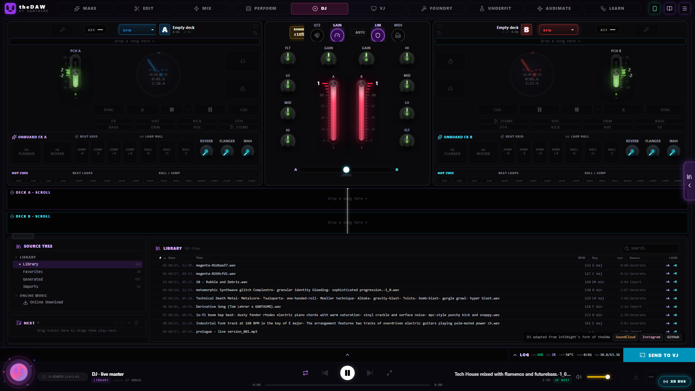</p>

Load a track on deck A and another on deck B from the browser at the bottom. Press SYNC to match the tempo of the incoming deck to the playing deck. Each deck has pitch, key lock, a 3-band EQ, a filter, hotcues, beat loops, loop rolls, slip and quantize. The FX rack has flanger, reverb and wah per deck and a master limiter. STEMS separates a deck into stems with a fader for each one. CUE sends a deck to a headphone output. AUTOMIX plays through the NEXT list on its own. Reference: [User Guide §9](docs/USER_GUIDE.md#9-dj-tab).

### Run visuals: VJ

<p align="center">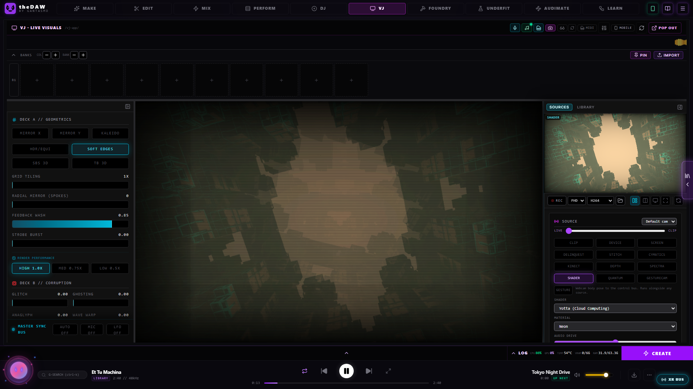</p>

The VJ tab is the [VJ-9000](https://github.com/gantasmo/VJ-9000) engine. Pick a source in the SOURCES panel: a webcam, a phone, tablet or Quest camera over the LAN, a GLSL shader, cymatics, a depth cloud, a spectrum, or a screen capture. Deck A applies geometry effects and deck B applies corruption effects. AUTOPILOT changes the picture on its own, BPM SYNC ties changes to the beat, and MIDI maps any control to a controller. REC records to WebM, and the backend transcodes it. Reference: [User Guide §10](docs/USER_GUIDE.md#10-vj-tab).

### Play live: PERFORM

<p align="center">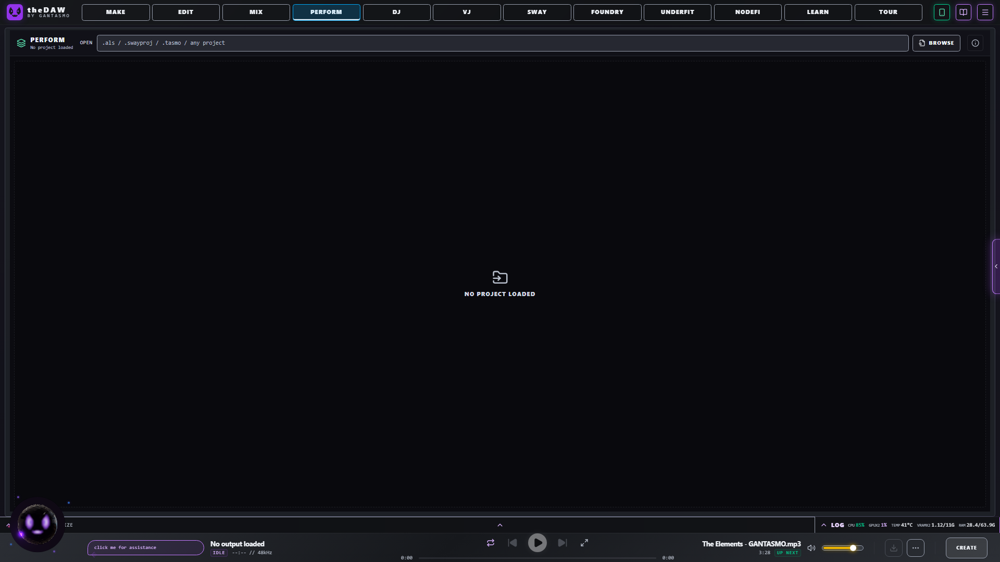</p>

Open an Ableton set or a `.tasmo` project in the OPEN field. Each column is a track and each row is a scene. Click a clip to launch it, or click a scene to launch every clip in that row. Clips loop, warp to the tempo, and run through the track mixer and effects. Sway Perform adds pad effect punches, a template per song, and the SwayCommand deck for assigning a controller. Reference: [Sway Perform](docs/guides/sway-perform-live.md).

### Design a plugin interface: FOUNDRY

<p align="center">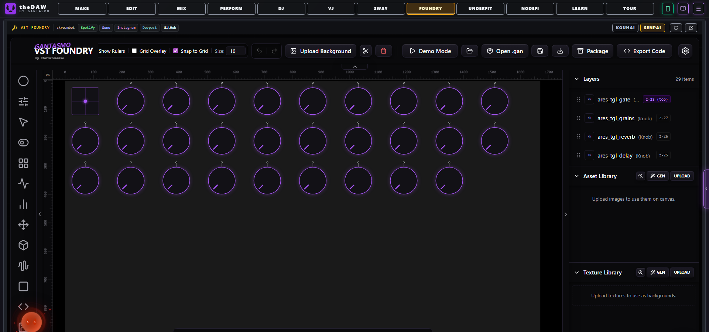</p>

The Foundry is a canvas for plugin interfaces. Drag knobs, sliders, meters, buttons, displays and images from the left palette. Upload a background image or pick a texture. OPEN .GAN opens an existing plugin to edit, such as the included Ares shown above. DEMO MODE switches between editing the controls and operating them. EXPORT CODE and PACKAGE write the design as a `.gan` web-plugin, GANTASMO's plugin format, which loads in the MIX chain next to VST3 plugins and the built-in effects.

### Connect nodes: NODEFI

<p align="center">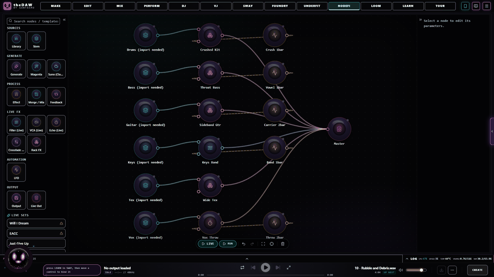</p>

NodeF.I. is a node graph editor. Drag nodes from the left list onto the canvas and connect their ports. In **Run** mode the graph executes through the AI stack (Stable Audio and Magenta generation, effects, merges, feedback loops) and saves the result to the library. In **Live** mode the same canvas plays stems, racks and routes in real time without a model. Reference: [NodeF.I.](docs/guides/nodefi.md).

### Train on your own audio: UNDERFIT

<p align="center">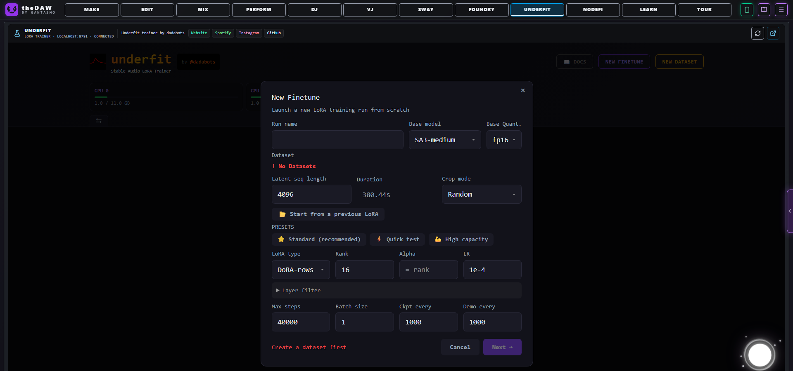</p>

Underfit trains LoRA adapters on your own audio. Press NEW DATASET to add audio, then NEW FINETUNE to set the adapter type (eight types), the layer filter, the interval gate and the SVD base, and start the run. Finished adapters appear in the LORA panel on the MAKE tab, where they stack and each one has a strength control. UNDERFIT builds and repairs its own training environment. Reference: [User Guide §22](docs/USER_GUIDE.md#22-lora-adapter-types).

### See your library as a graph: LEARN

<p align="center">
  
  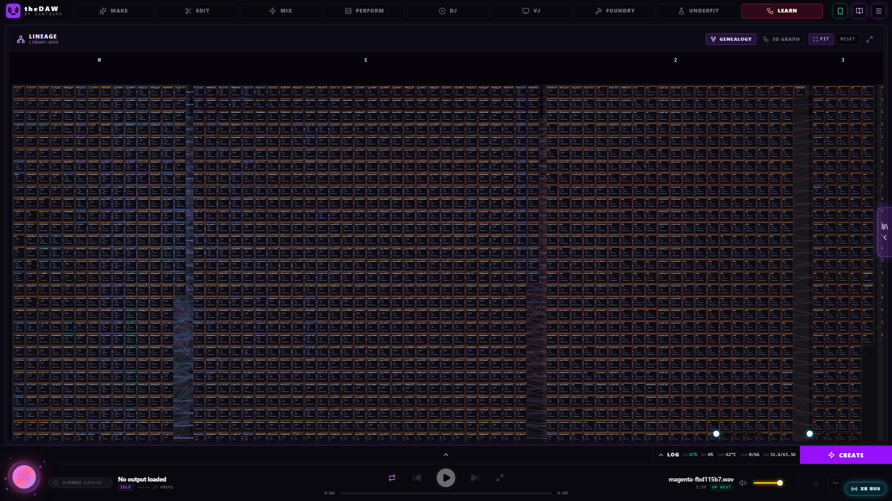
</p>

LEARN draws every track and the links between them as a 3D graph, a 2D graph, or a layered diagram. A remix, an inpaint, a stem split, a Chimera blend and a Suno cover each link to the track they came from. Reference: [User Guide §12](docs/USER_GUIDE.md#12-learn-tab).

### Find and organize tracks: Library and Catalogue

<p align="center">
  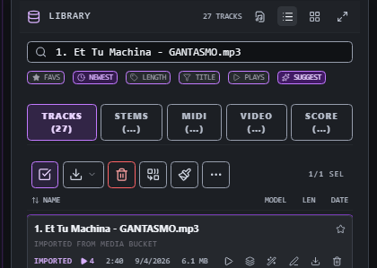
  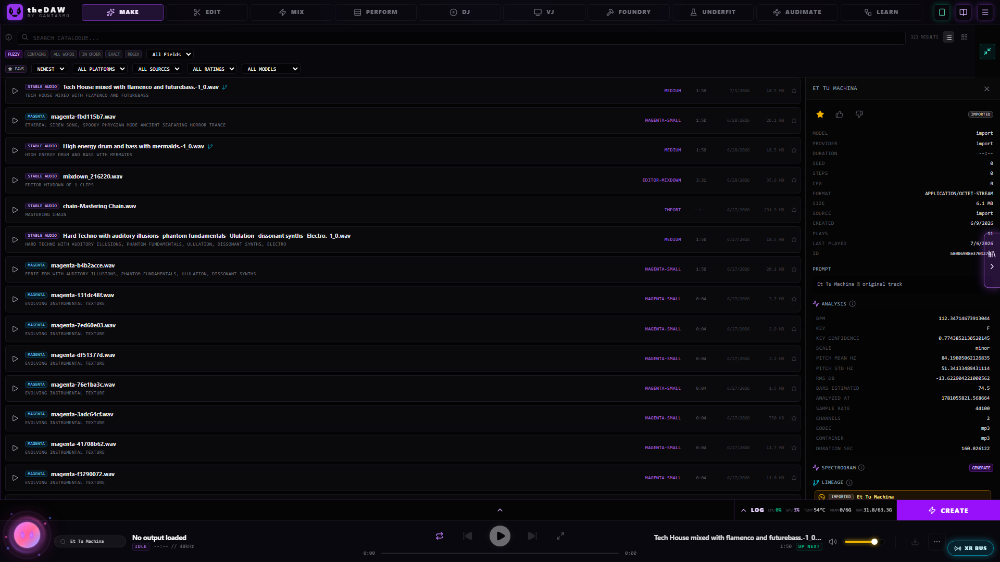
</p>

The library is on disk, with its metadata in `data/library.db`. Every generated track is saved with its prompt, model and settings. Imported tracks keep their lyrics and tags. Sub-tabs list a track's STEMS, MIDI, VIDEO and SCORE files. SUGGEST orders tracks into a playlist by Camelot key and BPM. The Catalogue is the full-width view of the same library with an inspector, spectrograms on demand and a lineage panel. Reference: [User Guide §13](docs/USER_GUIDE.md#13-library) and [§29](docs/USER_GUIDE.md#29-catalogue).

### The bottom panel

<p align="center">
  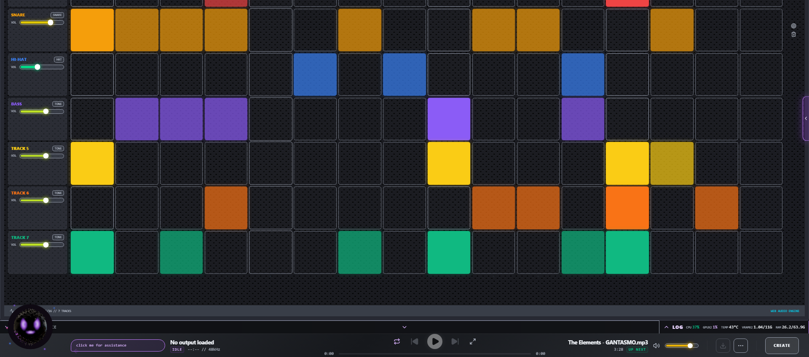
  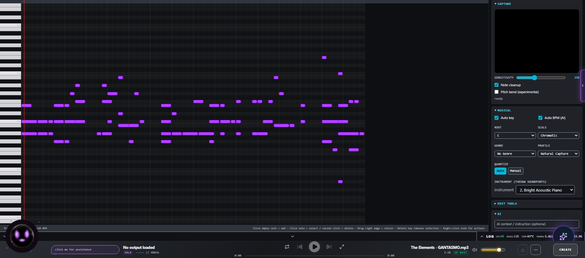
  <br>
  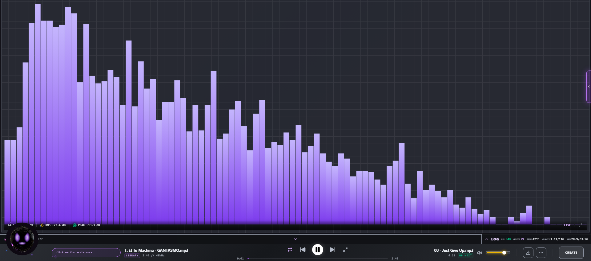
  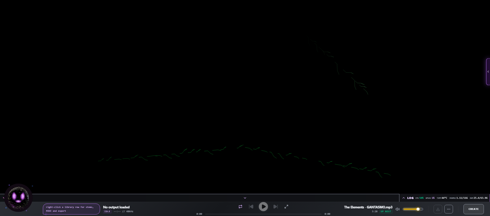
</p>

- **LEVELS** meters loudness, true peak, dynamics and stereo image against a delivery target.
- **VISUALIZE** shows an oscilloscope, a spectrum or a radial view.
- **MIDI** is a piano roll. It imports and exports MIDI and sends notes to the EDIT timeline.
- **SEQUENCE** is a step sequencer with 16 steps per voice.
- **DRAW** plays generative music from strokes on a canvas.
- **SCORE**, **SING** and **DETAILS** show the selected song's notation, lyrics and metadata.
- **MEDIA** holds dropped files and URL imports (YouTube and SoundCloud) before they go to a tab or the library.
- **SLIDE** is a touch control surface. **SWAY** controls music from camera-tracked movement.

Reference: [User Guide §14](docs/USER_GUIDE.md#14-step-sequencer) through [§16](docs/USER_GUIDE.md#16-bottom-panel-tabs).

### Controllers, XR, phone and Tour

Controller recognition knows about 110 device profiles, detects a connected controller, learns one by capture, and **Controller Vision** identifies a controller from a photo. The Audima Sway motion controller works natively. [theDAW-XR](https://github.com/gantasmo/theDAW-XR) turns a Meta Quest 3 into a hands-only controller with hand-tracked MIDI, passthrough video into VJ and co-located multiplayer. A phone web app pairs with the desktop for remote MAKE, transport, DJ and library control. The TOUR tab plans live dates on a map with venue, promoter and festival search, booking-contact lookup and a route. Reference: [User Guide §31](docs/USER_GUIDE.md#31-controller-vision), [§34](docs/USER_GUIDE.md#34-quest-and-xr-integrations), [§41](docs/USER_GUIDE.md#41-tour-tab) and [§42](docs/USER_GUIDE.md#42-mobile-companion-app).

### Footer, log and assistant

The footer is on every tab with transport, a seek bar, volume and download. The processing log keeps the last 500 entries. The assistant orb streams chat from any configured provider (Claude Code over the CLI, Gemini, Anthropic, OpenAI, Grok, Groq, OpenRouter, Ollama, LM Studio, llama.cpp, vLLM), accepts attachments, and answers questions from these docs. Reference: [User Guide §17](docs/USER_GUIDE.md#17-player-footer), [§18](docs/USER_GUIDE.md#18-processing-log) and [§32](docs/USER_GUIDE.md#32-admin-module-and-assistant-key-apis).

---

## Install

- **Windows script.** Double-click `theDAW.bat`. It checks prerequisites, runs `install/setup.ps1` to install missing tools after you confirm, then starts the backend and the UI in one console. See [docs/windows/setup-guide.md](docs/windows/setup-guide.md).
- **Linux and macOS script.** `./theDAW.sh` does the same on POSIX systems. See [docs/linux/setup-guide.md](docs/linux/setup-guide.md).
- **Release packages.** Every [GitHub Release](https://github.com/gantasmo/theDAW/releases) has `theDAW-Setup-<version>.exe`, `theDAW-<version>-arm64.dmg` and `ghcr.io/gantasmo/thedaw`. The installers include the Electron desktop app. See [docs/guides/electron-desktop-app.md](docs/guides/electron-desktop-app.md).
- **Pinokio launcher.** Install, start, update and reset from the Pinokio browser. See [docs/guides/pinokio-launcher.md](docs/guides/pinokio-launcher.md) and [theDAW-Pinokio](https://github.com/gantasmo/theDAW-Pinokio).
- **Source checkout.** `git clone --recurse-submodules`, then:

```bash
uv sync --group dev && (cd frontend && npm install)
uv run uvicorn backend.server:app --host 0.0.0.0 --port 8600   # backend  -> :8600
cd frontend && npm run dev                                        # frontend -> :5173
```

### Prerequisites

The launchers install these when one is missing. The list is here for manual setups.

| Tool | Used for |
|---|---|
| **[uv](https://docs.astral.sh/uv/getting-started/installation/)** | The Python environment and packages. Creates the venv and installs torch and CUDA. |
| **[Node.js](https://nodejs.org/) 20.19+ or 22.12+** | The frontend dev server and the VJ sidecar. |
| **[FFmpeg](https://www.gyan.dev/ffmpeg/builds/)** on PATH | Effects, exports, library import, MIDI conversion, URL import. |
| **[Git](https://git-scm.com/)** | Cloning the repo. `--recurse-submodules` fetches the Magenta sidecar source. |
| **NVIDIA driver 550+** | The Medium model, Magenta, Demucs and GPU whisper. The Small model and CPU whisper work without it. Turing cards (RTX 20xx, GTX 16xx) are supported. |

---

## Models

| Key | Type | Params | Autoencoder | Hardware | Max duration |
|---|---|---|---|---|---|
| `small` | ARC | 433 M | SAME-S | CPU | 120 s |
| `medium` | ARC | 1.4 B | SAME-L | GPU (CUDA) | 380 s |
| `small-rf` / `medium-rf` | RF | 433 M / 1.4 B | SAME-S / SAME-L | CPU / GPU | 120 / 380 s |
| `same-s` / `same-l` | Autoencoder | 266 M / 1.7 B | n/a | CPU / GPU | n/a |

ARC checkpoints are post-trained for 8-step inference at `cfg_scale=1`. RF checkpoints are rectified-flow bases for LoRA training at `cfg_scale=7` and about 50 steps. Nothing downloads at startup. **Local only** is on by default. Once downloads are allowed in **Settings → Models**, a model loads on the first generation that needs it. Checkpoints already on disk can be registered in the same panel or by placing them in a `models/` folder at the repo root. The gated Stability repositories fall back to a public mirror of the same weights, and a Hugging Face token unlocks the originals. [User Guide §21](docs/USER_GUIDE.md#21-models) has the download table.

---

## Python API

```python
from stable_audio_3 import StableAudioModel
pipe = StableAudioModel.from_pretrained("medium")

# Text-to-audio
audio = pipe.generate(prompt="Lo-fi boom bap meets orchestral strings, 84 BPM", duration=180)

# Audio-to-audio. init_noise_level sets how far the result moves from the source.
audio = pipe.generate(init_audio=torchaudio.load("in.wav"), init_noise_level=0.9,
                      prompt="bossa nova bassline", duration=30)

# LoRA adapters stack; the strength can be changed at runtime.
pipe.load_lora("style.safetensors")
pipe.set_lora_strength(0.8)
audio = pipe.generate(
    prompt="...", duration=30,
    sampler_type="dpmpp",          # euler | rk4 | dpmpp | pingpong
    apg_scale=1.0,                 # Adaptive Projected Guidance
    cfg_interval=(0.0, 1.0),       # apply CFG only within this sigma range
)
```

[docs/workflows/lora.md](docs/workflows/lora.md) covers adapter types and layer filters. [docs/workflows/autoencoder.md](docs/workflows/autoencoder.md) covers the standalone autoencoder.

---

## Themes and layout

**Change the theme.** The hamburger menu opens Change Theme: sixteen themes (dark, metallic, paper, pastel and colour families) plus a custom theme built from any background image. A theme recolours every surface through shared design tokens. The screenshots on this page use **Brushed Steel**. Obsidian is the default.

<p align="center">
  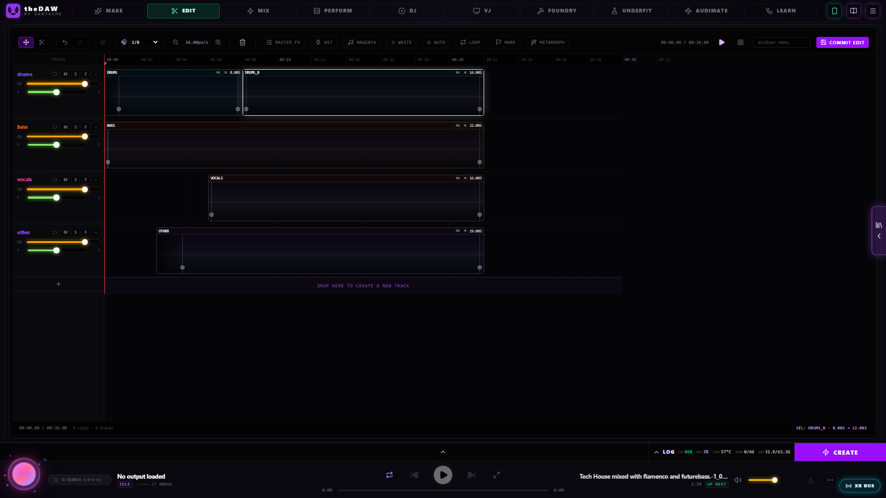
  
  
  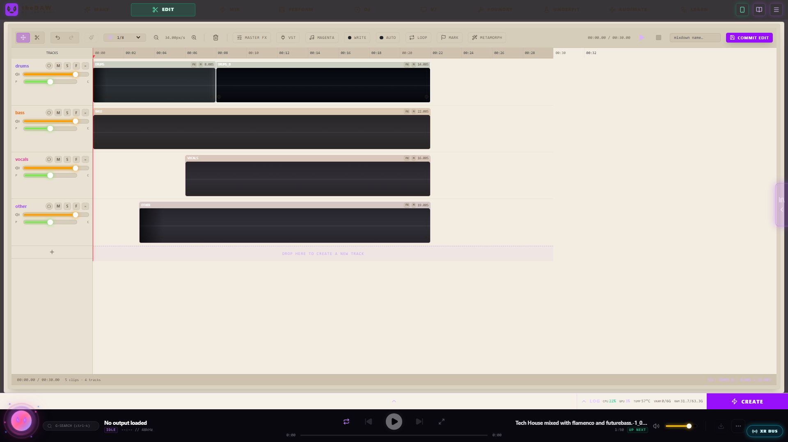
  
  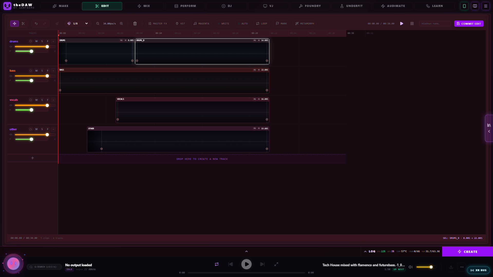
</p>

**Change the layout.** The library panel collapses, the right panel resizes, the bottom panel switches between its tabs and maximizes, the LEARN graph goes fullscreen, and the DJ tab's Design Mode rearranges the console.

---

## Documentation

| Document | Contents |
|---|---|
| [docs/USER_GUIDE.md](docs/USER_GUIDE.md) | The complete manual: every feature, control and endpoint. Also shown in the app by the Docs button. |
| [docs/guides/prompting.md](docs/guides/prompting.md) | How to write prompts, conditioning signals, and a style reference. |
| [docs/guides/notation-and-score.md](docs/guides/notation-and-score.md) | Audio to MIDI, sheet music, tabs, arrangements, play-along and prompt inference. |
| [docs/guides/nodefi.md](docs/guides/nodefi.md) | NodeF.I. node graphs: AI pipelines and live performance. |
| [docs/guides/sway-perform-live.md](docs/guides/sway-perform-live.md) | PERFORM, the SwayCommand deck, scenes, punches and templates. |
| [docs/guides/dj-and-genealogy.md](docs/guides/dj-and-genealogy.md) | The DJ console, the LEARN graph and the watch-link broadcast. |
| [docs/guides/model-overview.md](docs/guides/model-overview.md) | Architecture and model comparison. |
| [docs/guides/SUNO_EXTERNAL_API.md](docs/guides/SUNO_EXTERNAL_API.md) | Suno cloud generation API reference. |
| [docs/workflows/inference.md](docs/workflows/inference.md), [lora.md](docs/workflows/lora.md), [autoencoder.md](docs/workflows/autoencoder.md) | Inference modes, LoRA adapters and training, and the standalone autoencoder. |
| [docs/windows/setup-guide.md](docs/windows/setup-guide.md), [troubleshooting.md](docs/windows/troubleshooting.md) | Windows installation and fixes. |
| [docs/linux/setup-guide.md](docs/linux/setup-guide.md) | Linux installation: prerequisites, `./theDAW.sh`, and what differs from Windows. |
| [docs/RELEASING.md](docs/RELEASING.md) | How a release is cut and what CI builds. |

The GitHub **[Wiki](https://github.com/gantasmo/theDAW/wiki)** has the same index across theDAW and its sidecars.

---

## Ecosystem

| Project | Repo | Role |
|---|---|---|
| **VJ-9000** | [](https://github.com/gantasmo/VJ-9000) | The WebGL audio-reactive visual engine in the VJ tab. Also runs standalone. |
| **magenta-rt2-nvidia** | [](https://github.com/gantasmo/magenta-rt2-nvidia) | The first non-Mac port of Magenta RealTime 2, vendored at `sidecars/magenta-rt2-nvidia`. |
| **theDAW-XR** | [](https://github.com/gantasmo/theDAW-XR) | The Meta Quest 3 companion: hand-tracked MIDI, passthrough streaming and colocation. |
| **theDAW-Pinokio** | [](https://github.com/gantasmo/theDAW-Pinokio) | The one-click Pinokio launcher. |

---

## Structure

| Component | Location | Description |
|---|---|---|
| **ML pipeline** | `stable_audio_3/` | The DiT diffusion transformer, the SAME autoencoder, all samplers, LoRA training and inference, distribution-shift schedules. |
| **FastAPI backend** | `backend/server.py` | The HTTP server on port 8600: a generation job queue, FFmpeg audio processing, and model introspection. |
| **Backend modules** | `backend/modules/` | A plugin system. Each subdirectory has a `module.json` and a `router.py`. The loader mounts every enabled module and isolates failures: `analysis`, `chimera`, `effects`, `library`, `lyrics`, `midi`, `notation`, `stems`, `vocal`, `suno`, `magenta`, the XR bridges, `foundry`, `underfit`, and the rest. |
| **theDAW interface** | `frontend/` | React 19, Vite 7, Tailwind 4, Zustand 5. Eleven tabs (MAKE, EDIT, MIX, PERFORM, DJ, VJ, FOUNDRY, UNDERFIT, NODEFI, LEARN, TOUR), the library and Catalogue, and the bottom panel (Levels, Visualize, MIDI, Sequence, DRAW, Score, Sing, Details, Media, SLIDE, SWAY). The dev server on port 5173 proxies `/api/*` to the backend. |
| **Sidecars** | `sidecars/` | The vendored `magenta-rt2-nvidia` port, the `questcast` and `queststitch` Quest bridges, and the `magenta` studio sidecar. Demucs and whisper build their own isolated environments on first use. |

```
theDAW/
|-- theDAW.bat / theDAW.sh   <-- double-click or run to install everything and launch
|-- backend/                 <-- FastAPI server and the plugin modules behind /api/*
|-- frontend/                <-- the React / Vite interface served at http://localhost:5173
|-- stable_audio_3/          <-- the Stable Audio 3 inference library (DiT, SAME autoencoder, LoRA)
|-- sidecars/                <-- magenta-rt2-nvidia (run Setup-MRT2.bat once), magenta, questcast
|-- electron-ui/             <-- the optional desktop (Electron) app
|-- install/                 <-- setup.ps1, the installer theDAW.bat runs after you confirm
|-- docs/                    <-- the User Guide, setup guides, feature reference, and workflow docs
|-- data/                    <-- created at runtime; your library (gitignored, safe to back up)
|-- models/                  <-- OPTIONAL: put checkpoint folders here (see Models)
|-- tests/                   <-- the pytest suite
\-- scripts/                 <-- automation that captures the screenshots and the feature tour
```

---

## Architecture

theDAW is a React frontend over a FastAPI backend. The backend wraps the Stable Audio 3 pipeline, a plugin module system, and sidecar processes it starts on demand. Large features load on first use, not at startup. The wiki [Dataflow](https://github.com/gantasmo/theDAW/wiki/Dataflow) page maps every input and output in one chart.

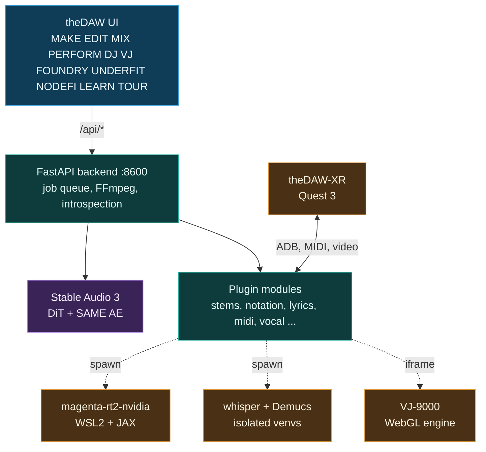
```mermaid
flowchart TD
  UI["theDAW UI<br/>MAKE EDIT MIX PERFORM DJ VJ FOUNDRY UNDERFIT NODEFI LEARN TOUR"]:::in
  API["FastAPI backend :8600<br/>job queue, FFmpeg, introspection"]:::proc
  SA3["Stable Audio 3<br/>DiT + SAME AE"]:::eng
  MODS["Plugin modules<br/>stems, notation, lyrics, midi, vocal ..."]:::proc
  MRT2["magenta-rt2-nvidia<br/>WSL2 + JAX"]:::side
  WSP["whisper + Demucs<br/>isolated venvs"]:::side
  VJ["VJ-9000<br/>WebGL engine"]:::side
  XR["theDAW-XR<br/>Quest 3"]:::side
  UI -->|/api/*| API
  API --> SA3
  API --> MODS
  MODS -. spawn .-> MRT2
  MODS -. spawn .-> WSP
  MODS -. iframe .-> VJ
  XR <-->|ADB, MIDI, video| MODS
  classDef in fill:#0f3d57,stroke:#3aa0db,color:#eaf6ff;
  classDef eng fill:#3a2356,stroke:#a877e0,color:#f3ecff;
  classDef proc fill:#0e3b3b,stroke:#2bb3a3,color:#e6fffb;
  classDef side fill:#4a3115,stroke:#e09a3a,color:#fff4e3;
```

**Generation.** The prompt, the init audio, the inpaint region and the Chimera stack all condition one generation. The DiT produces latents, the autoencoder decodes them to audio, the result is saved to the library, and LEARN records where it came from.

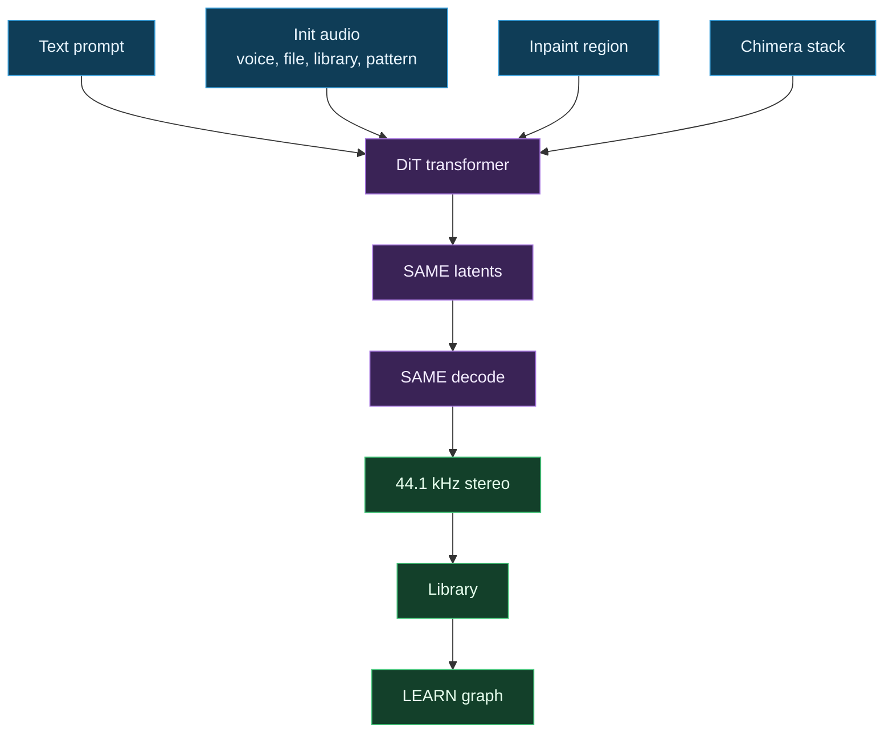
```mermaid
flowchart TD
  P["Text prompt"]:::in
  INIT["Init audio<br/>voice, file, library, pattern"]:::in
  MASK["Inpaint region"]:::in
  CHI["Chimera stack"]:::in
  P --> GEN
  INIT --> GEN
  MASK --> GEN
  CHI --> GEN
  GEN["DiT transformer"]:::eng --> LAT["SAME latents"]:::eng
  LAT --> DEC["SAME decode"]:::eng
  DEC --> WAV["44.1 kHz stereo"]:::out
  WAV --> LIB["Library"]:::out
  LIB --> LRN["LEARN graph"]:::out
  classDef in fill:#0f3d57,stroke:#3aa0db,color:#eaf6ff;
  classDef eng fill:#3a2356,stroke:#a877e0,color:#f3ecff;
  classDef out fill:#13402a,stroke:#46c47a,color:#e7ffee;
```

**From one song to stems, MIDI, a score and lyrics.** One library entry can be separated into stems, converted to MIDI, engraved, played along to, and sung to. Each result is stored with the entry.

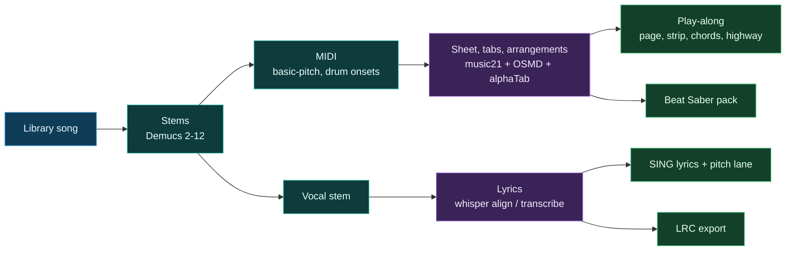
```mermaid
flowchart LR
  SONG["Library song"]:::in --> STEMS["Stems<br/>Demucs 2-12"]:::proc
  STEMS --> MIDI["MIDI<br/>basic-pitch, drum onsets"]:::proc
  MIDI --> SCORE["Sheet, tabs, arrangements<br/>music21 + OSMD + alphaTab"]:::eng
  SCORE --> PLAY["Play-along<br/>page, strip, chords, highway"]:::out
  SCORE --> BS["Beat Saber pack"]:::out
  STEMS --> VOX["Vocal stem"]:::proc
  VOX --> LYR["Lyrics<br/>whisper align / transcribe"]:::eng
  LYR --> SING["SING lyrics + pitch lane"]:::out
  LYR --> LRC["LRC export"]:::out
  classDef in fill:#0f3d57,stroke:#3aa0db,color:#eaf6ff;
  classDef eng fill:#3a2356,stroke:#a877e0,color:#f3ecff;
  classDef proc fill:#0e3b3b,stroke:#2bb3a3,color:#e6fffb;
  classDef out fill:#13402a,stroke:#46c47a,color:#e7ffee;
```

---

## Automation

theDAW generates its own documentation from the running app. `scripts/screenshots/` drives a real session through every tab and writes the screenshots on this page and a feature-coverage report. `frontend/_capture_clips.mjs` records the feature-tour video. The in-app assistant answers from the same documents through a RAG index, so the docs, the video and the assistant come from one source.

---

## Troubleshooting

**"API UNREACHABLE" banner.** The backend is not listening on port 8600. Test it with `curl http://localhost:8600/api/health`. On Windows, `.\theDAW.bat` clears stale processes on its own.

**Out of memory on the Medium model.** Use the `small` model, a shorter `duration`, or close other CUDA processes.

**Static or noise from the Medium model on Windows.** Check `GET /api/health` for `flash_attention_active`. On Turing GPUs (RTX 20xx, GTX 16xx) it reads false by design and the model runs on an equivalent fallback. On Ampere or newer with a broken wheel, reinstall a matching wheel from [kingbri1/flash-attention](https://github.com/kingbri1/flash-attention/releases).

[User Guide §23](docs/USER_GUIDE.md#23-troubleshooting) has the full list.

---

## About GANTASMO

> **GANTASMO** is an amorphous entity by [Daniel Joaquin Trujillo](https://github.com/danieljtrujillo) and [Josh Valenzuela](https://github.com/StarskreamEXE) that defies conventional classification. We make thought provoking, highly technical, yet listenable music inspired by the underappreciated pioneers of modern music. Beyond musical composition and performance, GANTASMO is a powerhouse of research and development in the fields of Artificial Intelligence, Augmented Reality, Virtual Reality, the democratization of musical tools and education, and the preservation and evolution of musical history and traditions predating modern recording infrastructure.

## Credits

theDAW was built by **[GANTASMO](https://github.com/gantasmo)** as part of the [Music Hackspace](https://musichackspace.org) Music Technology Hackathon at [Berklee College of Music](https://www.berklee.edu).

## Built With

- **[Stability AI](https://stability.ai)** provides Stable Audio 3 and [stable-audio-tools](https://github.com/Stability-AI/stable-audio-tools), the diffusion model and pipeline at the core of theDAW.
- **[Magenta](https://github.com/magenta)** RealTime by **[Google DeepMind](https://deepmind.google)** provides real-time music generation, running through theDAW's own [NVIDIA/CUDA port](https://github.com/gantasmo/magenta-rt2-nvidia).
- **[Suno](https://suno.com)** provides cloud music generation.
- **[T5Gemma](https://huggingface.co/google/t5gemma-b-b-ul2)** by Google handles text conditioning.
- **[Demucs](https://github.com/facebookresearch/demucs)** by Meta AI separates stems, **[basic-pitch](https://github.com/spotify/basic-pitch)** by Spotify converts audio to MIDI, the **[MMS](https://ai.meta.com/research/publications/scaling-speech-technology-to-1000-languages/)** forced aligner by Meta AI (through torchaudio) times lyrics, and **[faster-whisper](https://github.com/SYSTRAN/faster-whisper)** transcribes lyrics and reviews them.
- **[music21](https://github.com/cuthbertLab/music21)** by MIT builds MusicXML, ABC, tabs and arrangements, **[alphaTab](https://www.alphatab.net)** and **[OpenSheetMusicDisplay](https://opensheetmusicdisplay.org)** render tablature and scores in the browser, and **[MuseScore](https://musescore.org)** engraves PDF and SVG.
- **[MLX](https://github.com/ml-explore/mlx)** by Apple is the inference core the Magenta port builds on, extended here with a CUDA backend.
- **[PyTorch](https://pytorch.org)**, **[FFmpeg](https://ffmpeg.org)**, **[three.js](https://threejs.org)**, **[react-force-graph](https://github.com/vasturiano/react-force-graph)**, **[WaveSurfer.js](https://wavesurfer.xyz)**, **[React](https://react.dev)**, **[Vite](https://vitejs.dev)**, and **[Tailwind CSS](https://tailwindcss.com)** are used throughout, alongside the wider open-source community.

Corrections and additions to this list are welcome through a GitHub issue.

## Special Thanks

To [Music Hackspace](https://musichackspace.org) and [Berklee College of Music](https://www.berklee.edu) for hosting the hackathon, and to Zack, CJ, Jordi, Zach, and Matt from [Stability AI](https://stability.ai) for their continued help and support.

---

<p align="center">
  <a href="https://open.spotify.com/artist/4q5n0QgK6mvyuw8FRzhuNA"></a>
  <a href="https://www.youtube.com/@GANTASMO"></a>
  <a href="https://www.instagram.com/gantasmo"></a>
  <a href="https://x.com/gantasmo"></a>
  <a href="https://gantasmo.com"></a>
</p>

<p align="center"><sub>Made by <a href="https://github.com/danieljtrujillo">Daniel Joaquin Trujillo</a> and <a href="https://github.com/StarskreamEXE">Josh Valenzuela</a> as GANTASMO.</sub></p>
