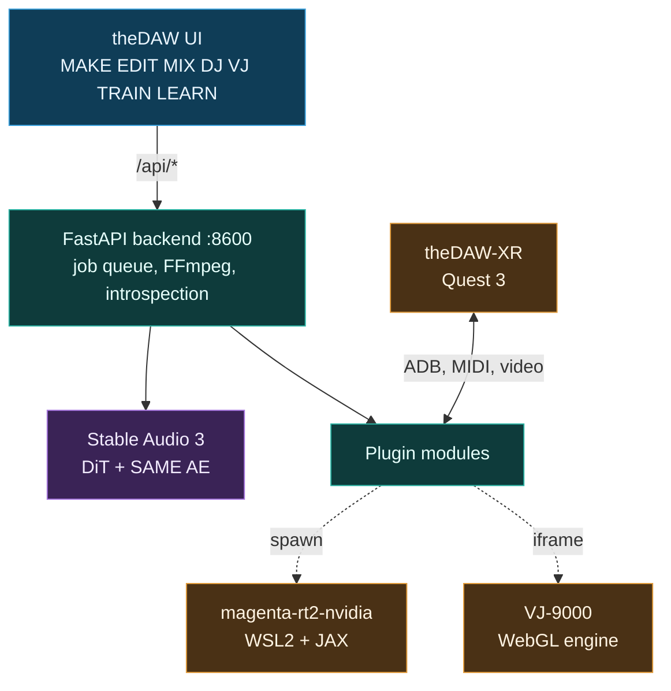
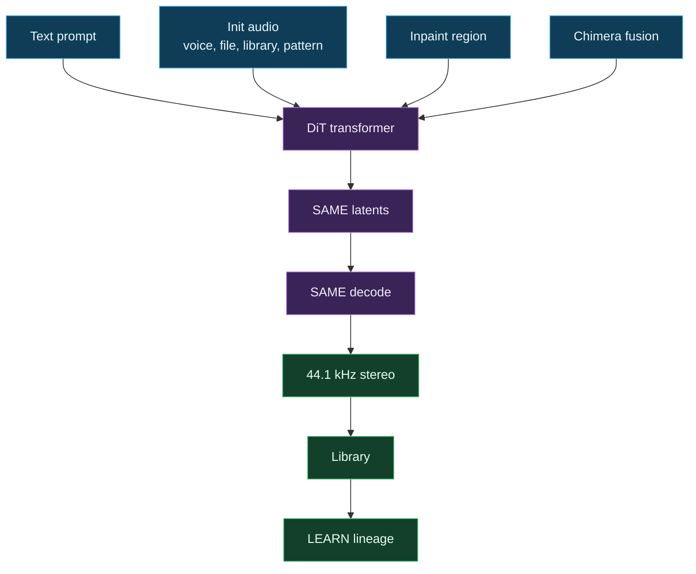
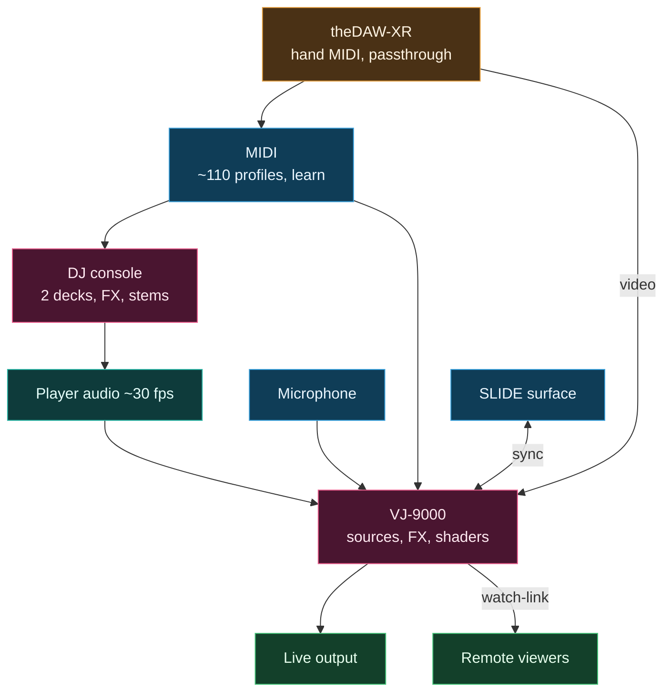

# Architecture

theDAW is a React frontend over a FastAPI backend that wraps the Stable Audio 3 pipeline, a plugin module system, and a set of spawned sidecars. The frontend on port 5173 proxies `/api/*` to the backend on port 8600.

## System

## Generation

Several inputs condition one generation. The DiT renders SAME latents, the autoencoder decodes them, every render saves to the library, and LEARN draws the lineage.

## Routing

Player audio, a microphone, MIDI, and the SLIDE surface drive the VJ engine and the DJ console, and theDAW-XR feeds hand-tracked MIDI and passthrough video into the same buses.

## Inference

The pipeline runs in two stages. The DiT generates compressed SAME latents from the conditioning, and the same autoencoder decodes them to 44.1 kHz stereo. Duration is set directly, so a request produces exactly the requested length with no wasted padding. See [Models](Models) and the [model overview](https://github.com/gantasmo/theDAW/blob/main/docs/guides/model-overview.md).

## Reference

- [Dataflow](Dataflow) maps every input, process, and output in one chart.
- [Modules and Sidecars](Modules-and-Sidecars) lists the plugin modules and spawned processes.
- [User Guide §2](https://github.com/gantasmo/theDAW/blob/main/docs/USER_GUIDE.md#2-architecture) holds the full technical description.

---

<a href="Getting-Started">&lt; Previous: Getting Started</a> &nbsp; | &nbsp; <a href="Dataflow">Next: Dataflow &gt;</a>

