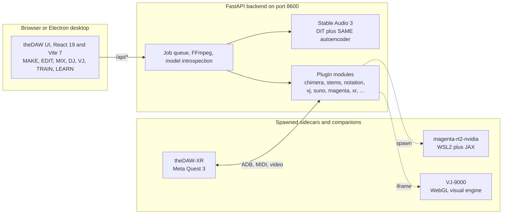
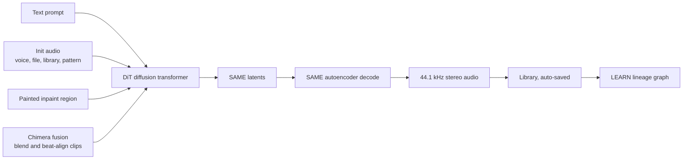
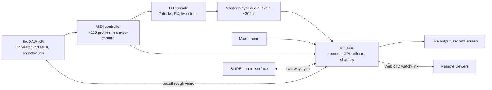

# Architecture

theDAW is a React frontend over a FastAPI backend that wraps the Stable Audio 3 pipeline, a plugin module system, and a set of spawned sidecars and companion apps. The frontend on port 5173 proxies `/api/*` to the backend on port 8600.

## System map

## Generation pipeline

Several inputs condition one generation. A DiT diffusion transformer renders SAME latents, the SAME autoencoder decodes them to audio, every render saves to the library, and LEARN draws the lineage between pieces.

## Live rig signal flow

Player audio, a microphone, MIDI, and the SLIDE surface drive the VJ engine and the DJ console, and theDAW-XR feeds hand-tracked MIDI and passthrough video into the same buses.

## Two-stage model

The Stable Audio 3 pipeline runs in two stages. The DiT generates compressed SAME latents from the conditioning, and the same autoencoder decodes those latents to 44.1 kHz stereo audio. Duration is set directly, so a request produces exactly the requested length with no wasted padding. See [Models](Models) and the [model overview](https://github.com/gantasmo/theDAW/blob/main/docs/guides/model-overview.md).

## Where to go next

- [Modules and Sidecars](Modules-and-Sidecars) lists the plugin modules and the spawned processes.
- [User Guide §2 Architecture](https://github.com/gantasmo/theDAW/blob/main/docs/USER_GUIDE.md#2-architecture) has the full technical description.
