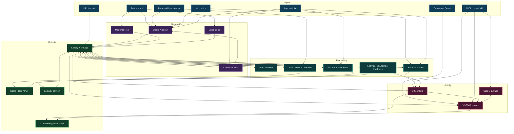

# Dataflow

One map of every input, engine, process, and output in theDAW, and how they feed each other. The library is the hub: nearly everything writes to it, and most processes read from it. Colors group nodes by role (inputs blue, generation purple, processing teal, live rig magenta, outputs green).

The same flow in words: prompts, voice, files, patterns, and URLs feed the generation engines and the library; the library feeds editing, mixing, stems, notation, analysis, and the live rig; those processes write back to the library or out to scores, exports, and recordings; and MIDI, pose, and XR control runs the live rig. See [Architecture](Architecture) for the subsystem-level charts and [Workspaces](Workspaces) for what each stage does.

---

<a href="Architecture">&lt; Previous: Architecture</a> &nbsp; | &nbsp; <a href="Workspaces">Next: Workspaces &gt;</a>

