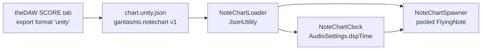

# theDAW XR - Note Chart

Reads a **gantasmo.notechart** JSON exported by theDAW's SCORE tab and spawns
engraved SMuFL notation glyphs that fly toward the player and land in sync with
the track. Noteheads, stems, flags, accidentals and rests, arriving on the beat.



## Components

| Component | Does |
|---|---|
| `NoteChart` and friends (`NoteChartData.cs`) | `[Serializable]` mirror of the schema, plus tempo-map conversion both ways |
| `NoteChartLoader` | Resolves a chart from TextAsset, StreamingAssets, persistentDataPath or theDAW's backend, validates the schema, fetches the track |
| `NoteChartClock` | Song position from `AudioSettings.dspTime` against a `PlayScheduled` start instant, with a count-in and a latency calibration offset |
| `NoteChartSpawner` | Builds the merged spawn schedule, pools glyphs, places them every frame, judges input against the raw onsets |
| `FlyingNote` | One glyph in flight; position is a pure function of song time |
| `StaffLayout` | `staffStep` to metres, part to lane, staff to a block inside its lane |
| `SmuflGlyphs` | Name and codepoint table for Bravura, plus a font self-test |

## Setup

1. `GANTASMO > Note Chart > Build Rig In Scene`. That adds the clock, the
   loader, the spawner, a staff layout, spawn and hit anchors, and an inactive
   glyph template the pool clones from.
2. Generate the Bravura TMP font asset (below) and assign it to the
   `Flying Note Template/Glyph` and `.../Accidental` text objects.
3. Point the loader at a chart: drop the `.unity.json` into
   `Assets/StreamingAssets/`, or set `artifactId` and let it fetch from theDAW.

theDAW side: SCORE tab, export format `unity`, which registers a `unityscore`
artifact. The loader's defaults reach the backend at `127.0.0.1:8600` over the
`adb reverse` tunnel theDAW's questmidi module already opens, so a
USB-tethered headset needs no network setup. For Wi-Fi, set the desktop's LAN
IP on `NoteChartLoader`.

## Building the Bravura TMP font asset

No font binary ships in this package. Bravura is already vendored in the theDAW
repository, under the SIL Open Font License 1.1:

```
frontend/node_modules/@coderline/alphatab/dist/font/Bravura.otf
frontend/node_modules/@coderline/alphatab/dist/font/Bravura-OFL.txt
```

Copy `Bravura.otf` (and the OFL text next to it, which must ship with anything
built from the font) into the consuming Unity project, then:

1. `Window > TextMeshPro > Font Asset Creator`.
2. Source Font File: `Bravura`.
3. Sampling Point Size: Auto Sizing. Padding: 5. Atlas Resolution 4096 x 4096.
4. **Character Set: Unicode Range (Hex)**, and enter `E000-ECFF`.
5. Render Mode: SDFAA (or SDF16 for crisper edges at large scale).
6. Generate, then Save as `Bravura SDF`.

Step 4 is the one that matters. Every SMuFL glyph lives in the Unicode Private
Use Area, and TMP's default character set is ASCII, which contains none of
them. A font asset built with the default set renders the entire chart as tofu
with no error message anywhere.

Confirm the result rather than trusting it:

```csharp
SmuflGlyphs.SelfTest(myBravuraFontAsset);   // logs every table entry the font cannot render
```

### Codepoints that matter

The chart carries a `glyphCodepoint` per event, so a scene never has to look
anything up. These are the ranges the export actually uses, and the ones the
font asset therefore has to contain:

| Range | Hex | Contents |
|---|---|---|
| Staff furniture | U+E014, U+E022, U+E030-E032 | 5-line staff, leger line, barlines |
| Clefs | U+E050, U+E052, U+E05C, U+E062, U+E069 | G, G8vb, C, F, unpitched percussion |
| Time signatures | U+E080-E08B | digits 0-9, common, cut common |
| Noteheads | U+E0A0-E0A9 | double whole, whole, half, black, x |
| Flags | U+E240-E247 | 8th through 64th, up and down |
| Accidentals | U+E260-E264 | flat, natural, sharp, double sharp, double flat |
| Composite notes | U+E1D0-E1E0 | notehead + stem + flag in one character |
| Augmentation dot | U+E1E7 | |
| Rests | U+E4E2-E4EA | double whole through 128th |

Composite notes are the workhorse: one glyph is one draw call and one collider,
so a chord member that shares a stem gets a bare notehead and only the chord
root carries the composite.

## How the timing works

### The clock is `AudioSettings.dspTime`

`AudioSource.time` is not used. It reports the mixer read position sampled at a
frame boundary, so it advances in DSP block steps (about 11 ms on desktop and
21 ms on the headset at typical buffer sizes), consecutive frames can read the
same value, and after an underrun it can step backwards. A spawner keyed off it
emits notes in bursts that scatter across a block boundary. `Time.time` is not
used either: it is frame time, so it hitches with the renderer and slews away
from playback over the length of a song.

`AudioSettings.dspTime` is the audio hardware clock, advanced by the DSP thread
once per block and never rewound. Combined with
`AudioSource.PlayScheduled(dspTime + lead)`, the exact instant playback begins
is known before it happens, so `songTime = dspTime - dspStart` is an absolute,
monotonic position in the recording. Every note in the song is placed by that
one subtraction, with no accumulated error.

Because `dspTime` only ticks once per block, `NoteChartClock` advances
`SongTime` by `Time.unscaledDeltaTime` between ticks and resynchronises on
every tick, capped so it can never outrun the next tick. Visuals move at frame
rate while staying locked to the hardware.

`DawBeatClock` in `com.gantasmo.songpacks` deliberately uses
`Time.unscaledTimeAsDouble` instead, because it extrapolates a *remote* DAW
grid with no local audio and a protocol that carries no timestamps. This
package plays a local `AudioClip`, so the better clock is available here. The
two coexist.

All time and musical-position math is `double`, never `float`.

### Spawn and flight

```
travelDistance = |spawnAnchor.position - hitAnchor.position|   metres
leadInSeconds  = travelDistance / approachSpeed                seconds
hitTime        = onset + timing.audioOffsetSec                 song seconds
spawnTime      = hitTime - leadInSeconds

per frame, for every live glyph:
  remaining = hitTime - songTime
  position  = hitPoint + approachDir * (remaining * approachSpeed)
```

At `songTime == hitTime` the remaining distance is zero and the glyph is on the
hit plane. Position is a pure function of song time rather than an integration,
so a frame hitch cannot desynchronise anything, and a restart or a seek places
every live glyph correctly on the next frame.

Glyphs are pooled and pre-warmed at load. A chart routinely carries thousands
of events, and per-note `Instantiate` stutters visibly on a headset. Size
`poolSize` from `stats.maxSimultaneous` and the lead-in: roughly
`densityNotesPerSec * leadInSeconds`, with headroom.

### Judge against raw, draw against quantized

The chart carries two onsets per event and they are different numbers by
construction. The engraved sheet is an idealization produced by quantizing the
transcription; the waveform never moved.

- **Draw with `onsetSec`** (quantized). Two eighths engraved as a beamed pair
  land 30 ms apart if drawn raw, the beam angle breaks, and the eye stops
  reading them as one rhythmic unit.
- **Judge with `onsetSecRaw`.** On a 1/16 grid at 120 BPM the grid unit is
  125 ms and the worst-case quantization displacement is half of that, 62.5 ms.
  Rhythm games use perfect windows of 25 to 45 ms, so judging against the
  engraved value scores a musically perfect strike as a miss.

`NoteChartSpawner.JudgeAt` does exactly that, and falls back to the engraved
value only when the chart sets `quantization.rawIsQuantized`, which is the
exporter's honest admission that no raw source existed. `visualTiming` lets the
visual blend toward raw when a swung groove matters more than beam geometry.

### What is drawn but never judged

`ChartEvent.IsHitBearing` is false for rests, tie continuations and releases,
grace notes, and tuplets the quantizer invented rather than a performer played
(actual count above 9, or a normal count that is neither a power of two nor 3,
which is how the real 12:11 and 12:7 groups in this project's transcriptions
are caught). All of them still spawn, because removing them breaks the rhythm
the eye reads. None of them scores: a tie tail would double the count on every
sustained chord, and a grace note lands inside another note's window.

## Design notes

- **JsonUtility, not Newtonsoft.** Newtonsoft is only transitively present in
  this project (depth 1, via Meta XR and Netcode), so nothing here may depend
  on it. `Gantasmo.DawRemote.DawJson` documents the same call. The schema is
  shaped for it: object root, no dictionaries, no unions, no nulls.
- **No package dependencies.** A note-chart scene runs standalone, with no
  reference to songpacks, dawremote or questmidi. Integration with
  `DawBeatClock` belongs in the consuming scene, not here.
- TextMeshPro is a builtin package in Unity 6 (resolved at 5.0.0 in this
  project's lockfile) and is referenced by asmdef only, matching
  `com.gantasmo.dawremote`. It is deliberately not pinned in `package.json`,
  because pinning the 3.0.6 that the Meta SDK asks for would downgrade it.
- `staffStep` counts diatonic positions from the bottom staff line, so one step
  is half a staff space. The exporter already resolved it against each part's
  clef, which is why a bass-clef part and a treble-clef part read correctly
  against the same lane origin. `ChartClef.lowestLineDiatonic` is carried so a
  runtime transposition can be re-engraved without a clef table here.
- Spelled pitch (`step`, `octave`, `alter`) is authoritative, not `midi`. MIDI
  63 is D#4 or Eb4 depending on context, and those sit on different staff
  steps.
